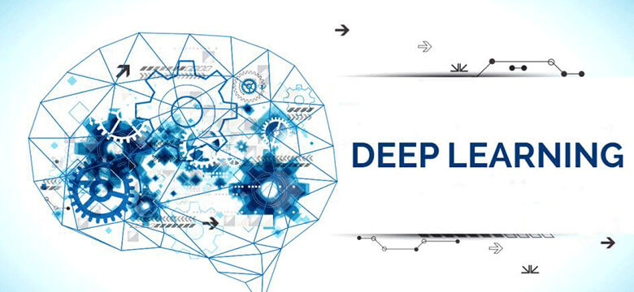

# Capítulo 11 - DeepLearnBook

<h2 style="text-align:center;">Aprendizado Com a Descida do Gradiente</h2>

No capítulo anterior definimos o design para a nossa rede neural e agora podemos começar o processo de aprendizado de máquina. Neste capítulo você vai compreender o que é o Aprendizado Com a Descida do Gradiente.

A primeira coisa que precisamos é um conjunto de dados para o treinamento da rede. Usaremos o conjunto de dados MNIST, que contém dezenas de milhares de imagens digitalizadas de dígitos manuscritos, juntamente com suas classificações corretas. 

O nome [MNIST](http://yann.lecun.com/exdb/mnist/) vem do fato de que é um subconjunto modificado de dois conjuntos de dados coletados pelo NIST, o Instituto Nacional de Padrões e Tecnologia dos Estados Unidos. Aqui estão algumas imagens do MNIST:

 

O MNIST tem duas partes. A primeira parte contém 60.000 imagens para serem usadas como dados de treinamento. Essas imagens são amostras de manuscritos escaneados de 250 pessoas, metade dos quais funcionários do Bureau do Censo dos EUA e metade dos estudantes do ensino médio. As imagens estão em escala de cinza e 28 por 28 pixels de tamanho. 

A segunda parte do conjunto de dados MNIST tem 10.000 imagens a serem usadas como dados de teste, também 28 por 28 pixels em escala de cinza. Usaremos os dados do teste para avaliar o quão bem a nossa rede neural aprendeu a reconhecer os dígitos. Para fazer deste um bom teste de desempenho, os dados de teste foram retirados de um conjunto diferente de 250 pessoas em relação aos dados de treinamento originais (embora ainda seja um grupo dividido entre funcionários do Census Bureau e alunos do ensino médio). Isso nos ajuda a confiar que nosso sistema pode reconhecer dígitos de pessoas cuja escrita não viu durante o treinamento.

Usaremos a notação x para indicar uma entrada (input) de treinamento. Será conveniente considerar cada entrada de treinamento x (cada imagem) como um vetor de 784 posições (28 x 28 pixels). A imagem abaixo representa como este vetor é construído:

 

 

Cada entrada no vetor representa o valor de cinza para um único pixel na imagem. Vamos indicar a saída correspondente desejada por y = y(x), onde y é um vetor com dimensão 10. Por exemplo, se uma imagem de treinamento particular, x, representa um 3, então y(x) = (0,0,0,1,0,0,0,0,0,0)T é a saída desejada da rede . Observe que T aqui é a operação de transposição, transformando um vetor de linha em um vetor comum (coluna). Vamos deixar isso mais claro. Observe a figura abaixo:

 

 

Vamos usar os pixels de imagem correspondentes ao fluxo inteiro chamado “features”. Os rótulos são One-Hot Encoded 1-hot. O rótulo que representa a classe de saída da imagem com dígito 3 torna-se “0001000000” uma vez que temos 10 classes para os 10 dígitos possíveis, onde o primeiro índice corresponde ao dígito “0” e o último corresponde ao dígito “9”.

O que queremos é um algoritmo que nos permita encontrar pesos e bias para que a saída da rede se aproxime de y(x) para todas as entradas de treinamento x. Para quantificar o quão bem estamos alcançando esse objetivo, definimos uma função de custo:

 

Função de Custo Quadrático

 

Na fórmula acima, w indica a coleta de todos os pesos na rede, b todos os bias (viés), n é o número total de entradas de treinamento, a é o vetor de saídas da rede (quando x é entrada) e a soma é sobre todas as entradas de treinamento x. Claro, a saída a depende de x, w e b, mas para manter a notação simples, eu não indiquei explicitamente essa dependência. 

A notação ‖v‖ apenas indica a função de comprimento usual para um vetor v. Chamaremos C a função de custo quadrático, que também é conhecido como o erro quadrático médio ou apenas o MSE (Mean Squared Error). Inspecionando a forma da função de custo quadrático, vemos que C (w, b) não é negativo, pois cada termo na soma não é negativo. Além disso, o custo C (w, b) torna-se pequeno, isto é, C (w, b) ≈ 0, precisamente quando y(x) é aproximadamente igual à saída, a, para todas as entradas de treinamento x.

Portanto, nosso algoritmo de treinamento faz um bom trabalho se ele pode encontrar pesos e bias para que C (w, b) ≈ 0. Isso significa basicamente que nosso modelo fez as previsões corretas, ou seja, cada vez que apresentamos ao modelo uma imagem com dígito 3, ele é capaz de reconhecer que se trata do número 3.

Em contraste, o algoritmo não terá boa performance, quando C (w, b) for um valor maior que 0 – isso significaria que nosso algoritmo não está conseguindo fazer as previsões, ou seja, quando apresentado a imagem com o dígito 3, ele não é capaz de prever que se trata de um número 3. Isso ocorre, porque a diferença entre o valor real da saída e o valor previsto pelo modelo, é muito alta. 

Assim, o objetivo do nosso algoritmo de treinamento será minimizar o custo C(w, b) em função dos pesos e dos bias. Em outras palavras, queremos encontrar um conjunto de pesos e bias que tornem o custo o menor possível. Vamos fazer isso usando um algoritmo conhecido como Descida do Gradiente (Gradient Descent).

Mas antes, uma pergunta. Por que introduzir o custo quadrático? Afinal, não nos interessamos principalmente pelo número de imagens corretamente classificadas pela rede? Por que não tentar maximizar esse número diretamente, em vez de minimizar uma medida, como o custo quadrático? O problema com isso é que o número de imagens corretamente classificadas não é uma “smooth function” dos pesos e bias na rede. 

Geralmente, fazer pequenas mudanças nos pesos e bias não causará nenhuma alteração no número de imagens de treinamento classificadas corretamente. Isso torna difícil descobrir como mudar os pesos e os bias para melhorar o desempenho. Se, em vez disso, usamos uma “smooth cost function”, como o custo quadrático, revela-se fácil descobrir como fazer pequenas mudanças nos pesos e nos bias para obter uma melhoria no custo. É por isso que nos concentramos primeiro na minimização do custo quadrático e somente depois examinaremos a precisão da classificação.

Mesmo considerando que queremos usar uma “smooth cost function”, você ainda pode se perguntar por que escolhemos a função quadrática. Talvez se escolhêssemos uma função de custo diferente, obteríamos um conjunto totalmente diferente de pesos e bias? Esta é uma preocupação válida e, mais tarde, revisitaremos a função de custo e faremos algumas modificações. No entanto, a função de custo quadrático mostrada anteriormente funciona perfeitamente para entender os conceitos básicos de aprendizagem em redes neurais, então ficaremos com isso por enquanto.

Recapitulando, nosso objetivo na construção de uma rede neural é encontrar pesos e bias que minimizem a função de custo quadrático C (w, b).

<h2 style="text-align:center;">Descida do Gradiente</h2>
 

A maioria das tarefas em Machine Learning são na verdade problemas de otimização e um dos algoritmos mais usados para isso é o Algoritmo de Descida do Gradiente. Para um iniciante, o nome Algoritmo de Descida do Gradiente pode parecer intimidante, mas espero que depois de ler o que está logo abaixo, isso deixe de ser um mistério para você.

A Descida do Gradiente é uma ferramenta padrão para otimizar funções complexas iterativamente dentro de um programa de computador. Seu objetivo é: dada alguma função arbitrária, encontrar um mínimo. Para alguns pequenos subconjuntos de funções – aqueles que são convexos – há apenas um único minumum que também acontece de ser global. 

Para as funções mais realistas, pode haver muitos mínimos, então a maioria dos mínimos são locais. Certifique-se de que a otimização encontre o “melhor” minimum e não fique preso em mínimos sub-otimistas (um problema comum durante o treinamento do algoritmo).

Para compreender a intuição da Descida do Gradiente, vamos simplificar um pouco as coisas. Vamos imaginar que simplesmente recebemos uma função de muitas variáveis e queremos minimizar essa função. Vamos desenvolver a técnica chamada Descida do Gradiente que pode ser usada para resolver tais problemas de minimização. Então, voltaremos para a função específica que queremos minimizar para as redes neurais.

Ok, suponhamos que estamos tentando minimizar alguma função, C(v). Esta poderia ser qualquer função de valor real de muitas variáveis, onde v = v1, v2, …. Observe que eu substitui a notação w e b por v para enfatizar que esta poderia ser qualquer função – não estamos mais pensando especificamente no contexto das redes neurais apenas. Para minimizar C (v), vamos imaginar C como uma função de apenas duas variáveis, que chamaremos v1 e v2, conforme pode ser visto na figura abaixo:

 

O que queremos é encontrar onde C atinge seu mínimo global. Fica claro, que para a função traçada no gráfico acima, podemos observar facilmente o gráfico e encontrar o mínimo. Mas uma função geral, C, pode ser uma função complicada de muitas variáveis, e geralmente não será possível apenas observar o gráfico para encontrar o mínimo.

Uma maneira de atacar o problema é usar Cálculo (especificamente Álgebra Linear) para tentar encontrar o mínimo de forma analítica. Podemos calcular derivadas e depois tentar usá-las para encontrar lugares onde C é um extremum. Isso pode funcionar quando C é uma função de apenas uma ou algumas variáveis. 

Mas vai se transformar em um pesadelo quando tivermos muitas outras variáveis. E para as redes neurais, muitas vezes queremos muito mais variáveis – as maiores redes neurais têm funções de custo que dependem de bilhões de pesos e bias de uma maneira extremamente complicada. Usando “apenas” Cálculo para minimizar isso, não funcionará e precisamos de algo mais! Precisamos de um algoritmo de otimização capaz de minimizar C (v).

Felizmente, há uma analogia que nos ajuda a compreender como encontrar a solução. Começamos por pensar em nossa função como uma espécie de vale e imaginamos uma bola rolando pela encosta do vale, conforme pode ser visto na figura abaixo. Nossa experiência diária nos diz que a bola acabará rolando para o fundo do vale. 

Talvez possamos usar essa ideia como forma de encontrar um mínimo para a função? Escolheríamos aleatoriamente um ponto de partida para uma bola (imaginária), e então simularíamos o movimento da bola enquanto ela rola até o fundo do vale. Poderíamos fazer essa simulação simplesmente por derivadas de computação da função C – essas derivadas nos diriam tudo o que precisamos saber sobre a “forma” local do vale, e, portanto, como nossa bola deve rolar.

Representação da Descida do Gradiente (com o objetivo de minimizar a função de custo)

 

Ou seja, a Descida do Gradiente é um algoritmo de otimização usado para encontrar os valores de parâmetros (coeficientes ou se preferir w e b – weight e bias) de uma função que minimizam uma função de custo. A Descida do Gradiente é melhor usada quando os parâmetros não podem ser calculados analiticamente (por exemplo, usando álgebra linear) e devem ser pesquisados por um algoritmo de otimização.

O procedimento começa com valores iniciais para o coeficiente ou coeficientes da função. Estes poderiam ser 0.0 ou um pequeno valor aleatório (a inicialização dos coeficiente é parte crítica do processo e diversas técnicas podem ser usadas, ficando a escolha a cargo do Cientista de Dados e do problema a ser resolvido com o modelo). Poderíamos iniciar assim nossos coeficientes (valores de w e b):

<b>coeficiente = 0,0</b>

 

O custo dos coeficientes é avaliado ligando-os à função e calculando o custo.

 

<b>custo = f (coeficiente)</b>

ou

 

<b>custo = avaliar (f (coeficiente))</b>

 

A derivada do custo é calculada. A derivada é um conceito de Cálculo e refere-se à inclinação da função em um determinado ponto. Precisamos conhecer a inclinação para que possamos conhecer a direção (sinal) para mover os valores dos coeficientes para obter um custo menor na próxima iteração.

 

<b>delta = derivado (custo)</b>

 

Agora que sabemos da derivada em que direção está em declive, podemos atualizar os valores dos coeficientes. Um parâmetro de taxa de aprendizagem (alfa) deve ser especificado e controla o quanto os coeficientes podem mudar em cada atualização.

 

<b>coeficiente = coeficiente – (alfa * delta)</b>

 

Este processo é repetido até que o custo dos coeficientes (função de custo) seja 0,0 ou próximo o suficiente de zero, indicando que as saídas da rede estão cada vez mais próximas dos valores reais (saídas desejadas).

A Descida do Gradiente é simples, mas exige que seja calculado o gradiente da função de custo ou a função que você está otimizando, mas além disso, é muito direto. Em resumo:

<blockquote>

Você divide seus dados em amostras e a cada amostra (sample), você passa as entradas pela rede, multiplica pelos pesos, soma, e no final você vai ter sua saida (a previsão da rede). Você então compara a saída da sua rede com o a resposta certa, calcula o erro, e então retroage esse erro (backpropagation), ajustando os pesos de cada neurônio de cada camada. Quando você acabar de fazer a atualização dos pesos, uma nova amostra é introduzida e ela será multiplicada pelos pesos já atualizados. Esse processo de atualizar os pesos é que é chamado de “aprendizado”.

Se você observar os algoritmos mais atuais, todos trabalham dentro de um conceito relativamente novo chamado de mini-lotes (mini-batches). Para otimizar a performance, o que se faz é passar pela rede múltiplas amostras (por exemplo 128 amostras), calcular o erro médio delas e então realizar o backpropagation e a atualização dos pesos. Do ponto de vista da atualização dos pesos, 1 amostra = 128 amostras. Esse é um conceito mais novo, necessário principalmente no treinamento de grandes modelos de Deep Learning.
</blockquote>

Em seguida, veremos como podemos usar isso em algoritmos de aprendizado de máquina.

<h2 style="text-align:center">Batch Gradient Descent em Aprendizado de Máquina</h2>

O objetivo de todos os algoritmos supervisionados de aprendizagem de máquina é estimar uma função de destino (f) que mapeia dados de entrada (X) para as variáveis ​​de saída (Y). Isso descreve todos os problemas de classificação e regressão (aprendizagem supervisionada).

Alguns algoritmos de aprendizagem de máquina têm coeficientes que caracterizam a estimativa de algoritmos para a função alvo (f). Diferentes algoritmos têm diferentes representações e diferentes coeficientes, mas muitos deles requerem um processo de otimização para encontrar o conjunto de coeficientes que resultam na melhor estimativa da função alvo. Os exemplos comuns de algoritmos com coeficientes que podem ser otimizados usando descida do gradiente são Regressão linear e Regressão logística.

A avaliação de quão próximo um modelo de aprendizagem de máquina estima a função de destino pode ser calculada de várias maneiras, muitas vezes específicas para o algoritmo de aprendizagem de máquina. 
A função de custo envolve a avaliação dos coeficientes no modelo de aprendizagem de máquina calculando uma previsão para o modelo para cada instância de treinamento no conjunto de dados e comparando as previsões com os valores de saída reais e calculando uma soma ou erro médio (como a Soma de Residuais Quadrados ou SSR no caso de regressão linear).

A partir da função de custo, uma derivada pode ser calculada para cada coeficiente para que ele possa ser atualizado usando exatamente a equação de atualização descrita acima.

O custo é calculado para um algoritmo de aprendizado de máquina em todo o conjunto de dados de treinamento para cada iteração do algoritmo de descida de gradiente. Uma iteração do algoritmo é chamada de um lote e esta forma de descida do gradiente é referida como descida do gradiente em lote (Batch Gradient Descent).

A descida do gradiente em lote é a forma mais comum de descida do gradiente em Machine Learning.

<h2 style="text-align:center">Stochastic Gradient Descent em Aprendizado de Máquina</h2>

A Descida do Gradiente pode ser lenta para executar em conjuntos de dados muito grandes. Como uma iteração do algoritmo de descida do gradiente requer uma previsão para cada instância no conjunto de dados de treinamento, pode demorar muito quando você tem muitos milhões de instâncias.

Em situações em que você possui grandes quantidades de dados, você pode usar uma variação da descida do gradiente chamada Stochastic Gradient Descent.

Nesta variação, o procedimento de descida do gradiente descrito acima é executado, mas a atualização para os coeficientes é realizada para cada instância de treinamento, em vez do final do lote de instâncias.

O primeiro passo do procedimento exige que a ordem do conjunto de dados de treinamento seja randomizada. Isto é, misturar a ordem que as atualizações são feitas para os coeficientes. Como os coeficientes são atualizados após cada instância de treinamento, as atualizações serão barulhentas saltando por todo o lado, e assim o custo correspondente funcionará. Ao misturar a ordem para as atualizações dos coeficientes, ela aproveita essa caminhada aleatória e evita que ela fique “distraída” ou presa.

O procedimento de atualização para os coeficientes é o mesmo que o anterior, exceto que o custo não é somado em todos os padrões de treinamento, mas sim calculado para um padrão de treinamento.

A aprendizagem pode ser muito mais rápida com descida de gradiente estocástica para conjuntos de dados de treinamento muito grandes e muitas vezes você só precisa de um pequeno número de passagens através do conjunto de dados para alcançar um conjunto de coeficientes bom o suficiente.

_**Referências:**_

[Formação Inteligência Artificial](https://www.datascienceacademy.com.br/pages/formacao-inteligencia-artificial)

[Machine Learning](https://www.amazon.com.br/Machine-Learning-Tom-M-Mitchell/dp/0070428077/ref=sr_1_fkmr0_1?ie=UTF8&qid=1482129989&sr=8-1-fkmr0&keywords=Machine+Learning+%28McGraw-Hill+International+Editions+Computer+Science+Series%29)

[Machine Learning com Scala e Spark](https://www.datascienceacademy.com.br/course?courseid=machine-learning-com-linguagem-scala)

[Análise Preditiva com Machine Learning em Java](https://www.datascienceacademy.com.br/course?courseid=machine-learning-em-java)

[MNIST](http://yann.lecun.com/exdb/mnist/)

[Derivada](https://pt.wikipedia.org/wiki/Derivada)

[The Elements of Statistical Learning: Data Mining, Inference, and Prediction, Second Edition](https://www.amazon.com.br/Elements-Statistical-Learning-Prediction-Statistics-ebook/dp/B00475AS2E/ref=sr_1_1?ie=UTF8&qid=1482130176&sr=8-1&keywords=The+Elements+of+Statistical+Learning%3A+Data+Mining%2C+Inference%2C+and+Prediction%2C+Second+Edition)

[Gradient Descent For Machine Learning](https://machinelearningmastery.com/gradient-descent-for-machine-learning/)

[Pattern Recognition and Machine Learning](https://www.amazon.com.br/Pattern-Recognition-Machine-Learning-Christopher/dp/0387310738/ref=sr_1_1?ie=UTF8&qid=1482130309&sr=8-1&keywords=Pattern+Recognition+and+Machine+Learning)

[Understanding Activation Functions in Neural Networks](https://medium.com/the-theory-of-everything/understanding-activation-functions-in-neural-networks-9491262884e0)

[Redes Neurais, princípios e práticas](https://www.amazon.com.br/Redes-Neurais-Princ%C3%ADpios-e-Pr%C3%A1tica-ebook/dp/B073QSG69Y/ref=tmm_kin_swatch_0?_encoding=UTF8&qid=1516302804&sr=1-1)

[An overview of gradient descent optimization algorithms](http://ruder.io/optimizing-gradient-descent/)

[Optimization: Stochastic Gradient Descent](http://ufldl.stanford.edu/tutorial/supervised/OptimizationStochasticGradientDescent/)

[Gradient Descent vs Stochastic Gradient Descent vs Mini-Batch Learning](https://sebastianraschka.com/faq/docs/closed-form-vs-gd.html)

Para acessar o contéudo completo do livro, acesse: [deeplearningbook](https://www.deeplearningbook.com.br/)   :smiley:
