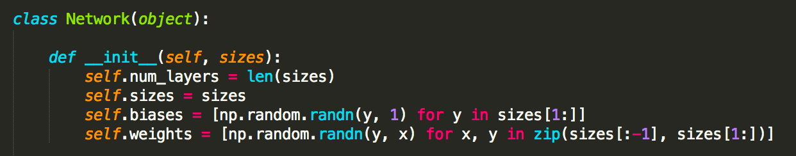
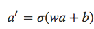
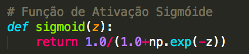
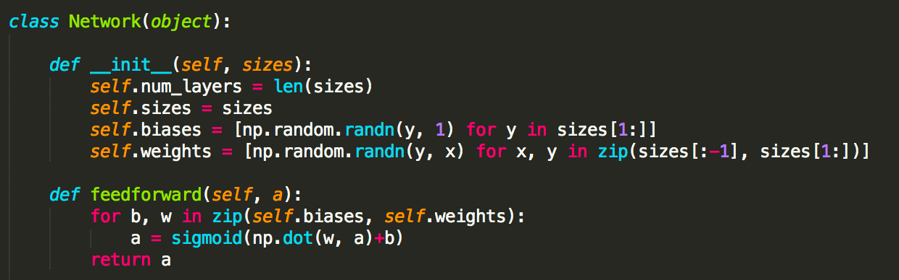
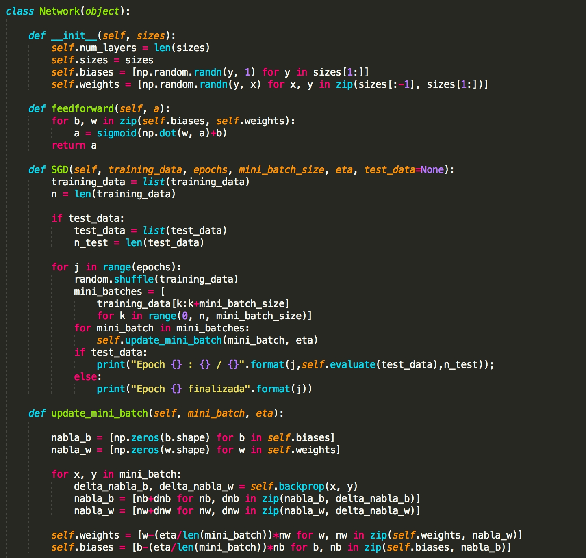
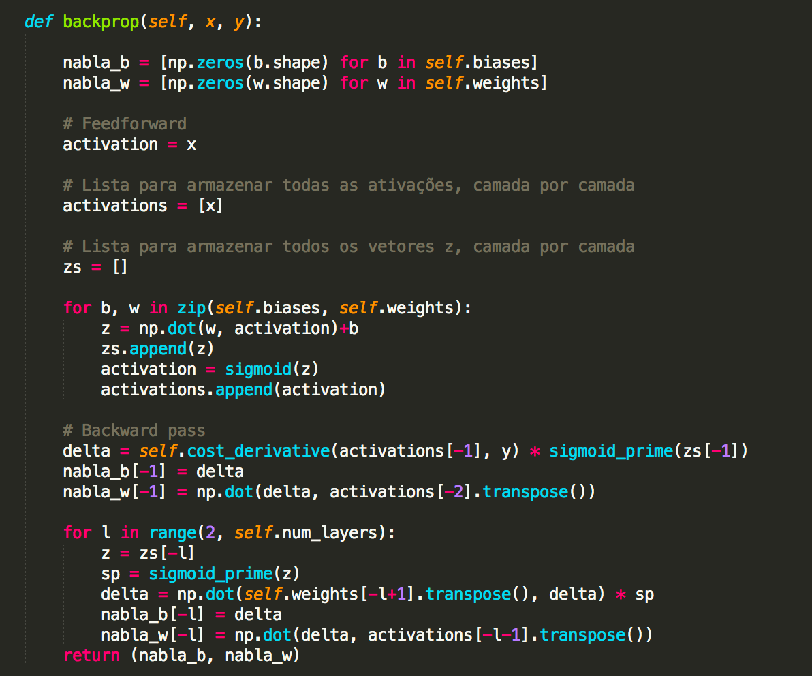

# Capítulo 13 - DeepLearnBook

<h2 style="text-align:center";>Construindo uma rede neural com Linguagem Python</h2>

Ok. Chegou a hora. Vamos escrever um programa em linguagem Python que aprenda como reconhecer dígitos manuscritos, usando Stochastic Gradient Descent e o dataset de treinamento MNIST. Se você chegou até aqui sem ler os capítulos anteriores, então pare imediatamente, leia os últimos 12 capítulos e depois volte aqui! Não tenha pressa! Não existe atalho para o aprendizado!

__*****************************************  Atenção *****************************************************__

Este capítulo considera que você já tem o interpretador Python (versão 3.6.x) instalado no seu computador, seja ele com sistema operacional Windows, MacOS ou Linux. Recomendamos que você instale o Anaconda e que já possua conhecimentos em linguagem Python. Se esse não for seu caso, antes de ler este capítulo e executar os exemplos aqui fornecidos, acesse o curso gratuito Python Fundamentos Para Análise de Dados.

Usaremos Python 3 e os scripts podem ser encontrados no repositório do livro no [GitHub](https://github.com/dsacademybr/DeepLearningBook). Vamos começar!

__**************************************************************************************************************__

Quando descrevemos o dataset MNIST anteriormente, dissemos que ele estava dividido em 60.000 imagens de treinamento e 10.000 imagens de teste. Essa é a descrição oficial do MNIST. Mas vamos dividir os dados de forma um pouco diferente. 

Deixaremos as imagens de teste como está, mas dividiremos o conjunto de treinamento MNIST de 60.000 imagens em duas partes: um conjunto de 50.000 imagens, que usaremos para treinar nossa rede neural e um conjunto separado de validação de 10.000 imagens. 

Não utilizaremos os dados de validação neste capítulo, porém mais tarde, aqui mesmo no livro, usaremos este dataset quando estivermos configurando certos hiperparâmetros da rede neural, como a taxa de aprendizado por exemplo. Embora os dados de validação não façam parte da especificação MNIST original, muitas pessoas usam o MNIST desta forma e o uso de dados de validação é comum em redes neurais. 

Quando eu me referir aos “dados de treinamento MNIST” de agora em diante, vou me referir ao nosso conjunto de dados de 50.000 imagens, e não ao conjunto de dados de 60.000 imagens. Fique atento!

Além dos dados MNIST, também precisamos de uma biblioteca Python chamada Numpy, para álgebra linear. Se você instalou o Anaconda, não precisa se preocupar, pois o Numpy já está instalado. Caso contrário, será necessário fazer a instalação do pacote.

Mas antes de carregar e dividir os dados, vamos compreender os principais recursos do nosso código para construção de uma rede neural. A peça central é uma classe chamada Network, que usamos para representar uma rede neural. Abaixo a classe Network e seu construtor:

 

Neste código, o parâmetro <b>sizes</b> contêm o número de neurônios nas respectivas camadas, sendo um objeto do tipo lista em Python. Então, por exemplo, se queremos criar um objeto da classe Network com 2 neurônios na primeira camada, 3 neurônios na segunda camada e 1 neurônio na camada final, aqui está o código que usamos para instanciar um objeto da classe Network::

<h3 style="text-align:center";>rede1 = Network([2, 3, 1])</h3> 

Os bias e pesos no objeto rede1 são todos inicializados aleatoriamente, usando a função Numpy <b>np.random.randn</b> para gerar distribuições gaussianas com 0 de média e desvio padrão 1. Esta inicialização aleatória dá ao nosso algoritmo de descida do gradiente estocástico um local para começar. 

Em capítulos posteriores, encontraremos melhores maneiras de inicializar os pesos e os bias. Observe que o código de inicialização de rede assume que a primeira camada de neurônios é uma camada de entrada e omite a definição de quaisquer bias para esses neurônios, uma vez que os bias são usados apenas para calcular as saídas de camadas posteriores.

Observe também que os bias e pesos são armazenados como listas de matrizes Numpy. Assim, por exemplo, rede1.weights[1] é uma matriz Numpy armazenando os pesos conectando a segunda e terceira camadas de neurônios. (Não é a primeira e segunda camadas, uma vez que a indexação da lista em Python começa em 0.) 

Uma vez que rede1.weights[1] é bastante detalhado, vamos apenas indicar essa matriz w. É uma matriz tal que wjk é o peso para a conexão entre o neurônio kth na segunda camada e o neurônio jth na terceira camada. Essa ordenação dos índices j e k pode parecer estranha – certamente teria mais sentido trocar os índices j e k? A grande vantagem de usar essa ordenação é que isso significa que o vetor de ativações da terceira camada de neurônios é:

 

Onde, <b>a</b> é o vetor de ativações da segunda camada de neurônios. Para obter um <b>a’</b> multiplicamos <b>a</b> pela matriz de peso <b>w</b>, e adicionamos o vetor <b>b</b> com os bias (se você leu os capítulos anteriores, isso não deve ser novidade agora). Em seguida, aplicamos a função <b>σ</b> de forma elementar a cada entrada no vetor <b>wa + b</b>. (Isto é chamado de vetorizar a função σ.)

Com tudo isso em mente, é fácil escrever código que computa a saída de uma instância de rede. Começamos definindo a função sigmoide:

 
 

Observe que quando a entrada z é um vetor ou uma matriz Numpy, Numpy aplica automaticamente a função sigmoid elementwise, ou seja, na forma vetorizada.

Em seguida, adicionamos um método feedforward à classe Network, que, dada a entrada a para a rede, retorna a saída corresponente. Basicamente o método feedforward aplica a Equação 1 mostrada acima, para cada camada:

 

A principal atividade que queremos que nossos objetos da classe Network façam é aprender. Para esse fim, criaremos um método SGD (Stochastic Gradient Descent). Aqui está o código. É um pouco misterioso em alguns lugares, mas vamos explicar em detalhes mais abaixo:

A principal atividade que queremos que nossos objetos da classe Network façam é aprender. Para esse fim, criaremos um método SGD (Stochastic Gradient Descent). Aqui está o código. É um pouco misterioso em alguns lugares, mas vamos explicar em detalhes mais abaixo:

 

 

A maior parte do trabalho é feita pela linha delta_nabla_b, delta_nabla_w = self.backprop (x, y). Isso invoca algo chamado algoritmo de backpropagation, que é uma maneira rápida de calcular o gradiente da função de custo. Portanto, update_mini_batch funciona simplesmente calculando esses gradientes para cada exemplo de treinamento no mini_batch e, em seguida, atualizando self.weights e self.biases adequadamente.

Abaixo você encontra o código para self.backprop, mas não estudaremos ele agora. Estudaremos em detalhes como funciona o backpropagation no próximo capítulo, incluindo o código para self.backprop. Por hora, basta assumir que ele se comporta conforme indicado, retornando o gradiente apropriado para o custo associado ao exemplo de treinamento x.

 

No programa completo disponível no [Github](https://github.com/dsacademybr/DeepLearningBook) você encontra comentários explicando como ocorre todo o processo. Além do self.backprop, o programa é auto-explicativo – todo o levantamento pesado é feito em self.SGD e self.update_mini_batch, que já discutimos. O método self.backprop faz uso de algumas funções extras para ajudar no cálculo do gradiente, nomeadamente sigmoid_prime, que calcula a derivada da função σ e self.cost_derivative.

A classe Network é em essência nosso algoritmo de rede neural. A partir dela criamos uma instância (como rede1), alimentamos com os dados de treinamento e realizamos o treinamento. Avaliamos então a performance da rede com dados de teste e repetimos todo o processo até alcançar o nível de acurácia desejado em nosso projeto. 

Quando o modelo final estiver pronto, usamos para realizar as previsões para as quais o modelo foi criado, apresentando a ele novos conjuntos de dados e extraindo as previsões. Perceba que este é um algoritmo de rede neural bem simples, mas que permite compreender como funcionam as redes neurais e mais tarde, aqui mesmo no livro, as redes neurais profundas ou Deep Learning.

No próximo capítulo vamos continuar trabalhando com este algoritmo e compreender como funciona o Backpropagation. Na sequência, vamos carregar os dados, treinar e testar nossa rede neural e então usá-la para reconhecer dígitos manuscritos. Até lá.

 

_**Referências:**_

[Formação Inteligência Artificial](https://www.datascienceacademy.com.br/pages/formacao-inteligencia-artificial)

[Python Fundamentos Para Análise de Dados](https://www.datascienceacademy.com.br/course?courseid=python-fundamentos)

[Machine Learning](https://www.datascienceacademy.com.br/pages/curso-machine-learning)

[Machine Learning com Scala e Spark](https://www.datascienceacademy.com.br/course?courseid=machine-learning-com-linguagem-scala)

[Análise Preditiva com Machine Learning em Java](https://www.datascienceacademy.com.br/course?courseid=machine-learning-em-java)

[MNIST](http://yann.lecun.com/exdb/mnist/)

[Derivada](https://pt.wikipedia.org/wiki/Derivada)

[Machine Learning](https://www.amazon.com.br/Machine-Learning-Tom-M-Mitchell/dp/0070428077/ref=sr_1_fkmr0_1?ie=UTF8&qid=1482129989&sr=8-1-fkmr0&keywords=Machine+Learning+%28McGraw-Hill+International+Editions+Computer+Science+Series%29)

[The Elements of Statistical Learning: Data Mining, Inference, and Prediction, Second Edition](https://www.amazon.com.br/Elements-Statistical-Learning-Prediction-Statistics-ebook/dp/B00475AS2E/ref=sr_1_1?ie=UTF8&qid=1482130176&sr=8-1&keywords=The+Elements+of+Statistical+Learning%3A+Data+Mining%2C+Inference%2C+and+Prediction%2C+Second+Edition)

[Gradient Descent For Machine Learning](https://machinelearningmastery.com/gradient-descent-for-machine-learning/)

[Pattern Recognition and Machine Learning](https://www.amazon.com.br/Pattern-Recognition-Machine-Learning-Christopher/dp/0387310738/ref=sr_1_1?ie=UTF8&qid=1482130309&sr=8-1&keywords=Pattern+Recognition+and+Machine+Learning)

[Understanding Activation Functions in Neural Networks](https://medium.com/the-theory-of-everything/understanding-activation-functions-in-neural-networks-9491262884e0)

[Redes Neurais, princípios e práticas](https://www.amazon.com.br/Redes-Neurais-Princ%C3%ADpios-e-Pr%C3%A1tica-ebook/dp/B073QSG69Y/ref=tmm_kin_swatch_0?_encoding=UTF8&qid=1516302804&sr=1-1)

[Neural Networks and Deep Learning](http://neuralnetworksanddeeplearning.com/)

[An overview of gradient descent optimization algorithms](http://ruder.io/optimizing-gradient-descent/)

[Optimization: Stochastic Gradient Descent](http://ufldl.stanford.edu/tutorial/supervised/OptimizationStochasticGradientDescent/)

[Gradient Descent vs Stochastic Gradient Descent vs Mini-Batch Learning](https://sebastianraschka.com/faq/docs/closed-form-vs-gd.html)

Para acessar o contéudo completo do livro, acesse: [deeplearningbook](https://www.deeplearningbook.com.br/)   :smiley:
