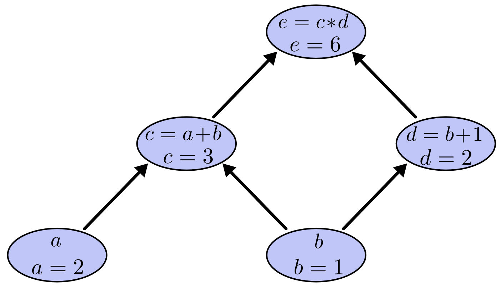
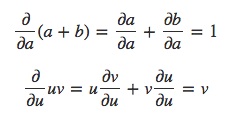

# Capítulo 14 - DeepLearnBook

<h2 style="text-align:center";>Algoritmo Backpropagation Parte 1 – Grafos Computacionais e Chain Rule</h2>

No último capítulo, vimos como as redes neurais podem aprender seus pesos e bias usando o algoritmo de gradiente descendente. Houve, no entanto, uma lacuna na nossa explicação: não discutimos como calcular o gradiente da função de custo. Neste capítulo, explicaremos sobre um algoritmo usado para calcular esses gradientes, um algoritmo conhecido como backpropagation. Como esse tema é a essência do treinamento de redes neurais, vamos dividí-lo em dois capítulos. Vamos começar com Algoritmo Backpropagation Parte 1 – Grafos Computacionais e Chain Rule.

O backpropagation é indiscutivelmente o algoritmo mais importante na história das redes neurais – sem backpropagation, seria quase impossível treinar redes de aprendizagem profunda da forma que vemos hoje. O backpropagation pode ser considerado a pedra angular das redes neurais modernas e consequentemente do Deep Learning.

O algoritmo backpropagation foi originalmente introduzido na década de 1970, mas sua importância não foi totalmente apreciada até um famoso [artigo de 1986 de David Rumelhart, Geoffrey Hinton e Ronald Williams](https://www.nature.com/articles/323533a0). Esse artigo descreve várias redes neurais em que o backpropagation funciona muito mais rapidamente do que as abordagens anteriores de aprendizado, possibilitando o uso de redes neurais para resolver problemas que antes eram insolúveis.

O backpropagation é o algoritmo-chave que faz o treinamento de modelos profundos algo computacionalmente tratável. Para as redes neurais modernas, ele pode tornar o treinamento com gradiente descendente até dez milhões de vezes mais rápido, em relação a uma implementação ingênua. Essa é a diferença entre um modelo que leva algumas horas ou dias para treinar e e outro que poderia levar anos (sem exagero).

Além de seu uso em Deep Learning, o backpropagation é uma poderosa ferramenta computacional em muitas outras áreas, desde previsão do tempo até a análise da estabilidade numérica. De fato, o algoritmo foi reinventado pelo menos dezenas de vezes em diferentes campos. O nome geral, independente da aplicação, é “diferenciação no modo reverso”.

Fundamentalmente, backpropagation é uma técnica para calcular derivadas rapidamente (não sabe o que é derivada? Consulte o link para um excelente vídeo em português explicando esse conceito em detalhes nas referências ao final deste capítulo). E é um truque essencial, não apenas em Deep Learning, mas em uma ampla variedade de situações de computação numérica. E para compreender backpropagation de forma efetiva, vamos primeiro compreender o conceito de grafo computacional e chain rule.

<h2 style="text-align:center">Grafo Computacional</h2>

Grafos computacionais são uma boa maneira de pensar em expressões matemáticas. O conceito de grafo foi introduzido por [Leonhard Euler](https://www.encyclopedia.com/science/encyclopedias-almanacs-transcripts-and-maps/birth-graph-theory-leonhard-euler-and-konigsberg-bridge-problem) em 1736 para tentar resolver o problema das [Pontes de Konigsberg](https://pt.wikipedia.org/wiki/Sete_pontes_de_K%C3%B6nigsberg). Grafos são modelos matemáticos para resolver problemas práticos do dia a dia, com várias aplicações no mundo real tais como: circuitos elétricos, redes de distribuição, relações de parentesco entre pessoas, análise de redes sociais, logística, redes de estradas, redes de computadores e muito mais. Grafos são muito usados para modelar problemas em computação.

Um Grafo é um modelo matemático que representa relações entre objetos. Um grafo G = (V, E) consiste de um conjunto de vértices **V** (também chamados de nós), ligados por um conjunto de bordas ou arestas **E**. 

Por exemplo, considere a expressão:

<h4 style="text-align:center">e = (a + b) ∗ (b + 1)</h4>

Existem três operações: duas adições e uma multiplicação. Para facilitar a compreensão sobre isso, vamos introduzir duas variáveis intermediárias c e d para que a saída de cada função tenha uma variável. Nós agora temos:

<h4 style="text-align:center">c = a+bd</h4>
<h4 style="text-align:center">d = b+1</h4>
<h4 style="text-align:center">e = c∗d</h4>

Para criar um grafo computacional, fazemos cada uma dessas operações nos nós, juntamente com as variáveis de entrada. Quando o valor de um nó é a entrada para outro nó, uma seta vai de um para outro e temos nesse caso um grafo direcionado.

Esses tipos de grafos surgem o tempo todo em Ciência da Computação, especialmente ao falar sobre programas funcionais. Eles estão intimamente relacionados com as noções de grafos de dependência e grafos de chamadas. Eles também são a principal abstração por trás do popular framework de Deep Learning, o TensorFlow.

Podemos avaliar a expressão definindo as variáveis de entrada para determinados valores e computando os nós através do grafo. Por exemplo, vamos definir a = 2 e b = 1:

A expressão, nesse exemplo, é avaliada como 6.

<h3 style="text-align:center";>Derivadas em Grafos Computacionais</h3>

Se alguém quiser entender derivadas em um grafo computacional, a chave é entender as derivadas nas bordas (arestas que conectam os nós no grafo). Se **a** afeta diretamente **c**, então queremos saber como isso afeta **c**. Se **a** muda um pouco, como **c** muda? Chamamos isso de derivada parcial de **c** em relação a **a**.

Para avaliar as derivadas parciais neste grafo, precisamos da regra da soma e da regra do produto:

Abaixo, o grafo tem a derivada em cada borda (aresta) rotulada.

E se quisermos entender como os nós que não estão diretamente conectados afetam uns aos outros? Vamos considerar como e é afetado por a. Se mudarmos a uma velocidade de 1, c também muda a uma velocidade de 1. Por sua vez, c mudando a uma velocidade de 1 faz com que e mude a uma velocidade de 2. Então e muda a uma taxa de 1 ∗ 2 em relação a a (analise o diagrama acima para visualizar isso).

A regra geral é somar todos os caminhos possíveis de um nó para o outro, multiplicando as derivadas em cada aresta do caminho. Por exemplo, para obter a derivada de e em relação a b, obtemos:

Isso explica como **b** afeta **e** através de **c** e também como isso afeta **d**.

Essa regra geral de “soma sobre caminhos” é apenas uma maneira diferente de pensar sobre a regra da cadeia multivariada ou **chain rule**.

<h3>Fatorando os Caminhos</h3>

O problema com apenas “somar os caminhos” é que é muito fácil obter uma explosão combinatória no número de caminhos possíveis.

No diagrama acima, existem três caminhos de X a Y, e mais três caminhos de Y a Z. Se quisermos obter a derivada ∂Z/∂X somando todos os caminhos, precisamos calcular 3 ∗ 3 = 9 caminhos:

O exemplo acima só tem nove caminhos, mas seria fácil o número de caminhos crescer exponencialmente à medida que o grafo se torna mais complicado. Em vez de apenas ingenuamente somar os caminhos, seria muito melhor fatorá-los:

É aí que entram a “diferenciação de modo de avanço” (forward-mode differentiation ou forward pass) e a “diferenciação de modo reverso” (reverse-mode differentiation ou backpropagation). Eles são algoritmos para calcular a soma de forma eficiente fatorando os caminhos. Em vez de somar todos os caminhos explicitamente, eles calculam a mesma soma de forma mais eficiente, mesclando os caminhos juntos novamente em cada nó. De fato, os dois algoritmos tocam cada borda exatamente uma vez!

A diferenciação do modo de avanço inicia em uma entrada para o grafo e se move em direção ao final. Em cada nó, soma todos os caminhos que se alimentam. Cada um desses caminhos representa uma maneira na qual a entrada afeta esse nó. Ao adicioná-los, obtemos a maneira total em que o nó é afetado pela entrada, isso é a derivada.

