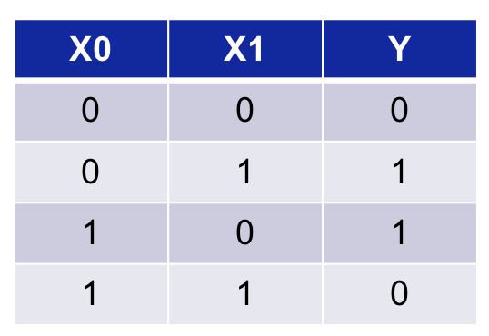
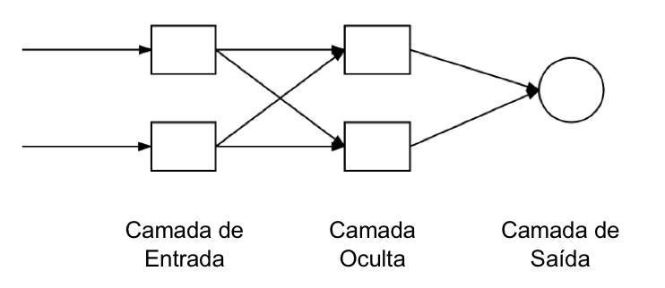
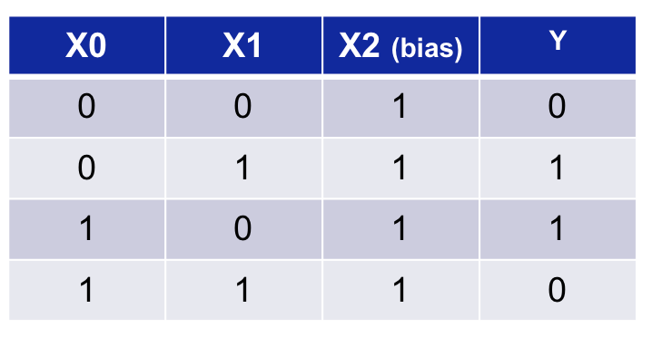
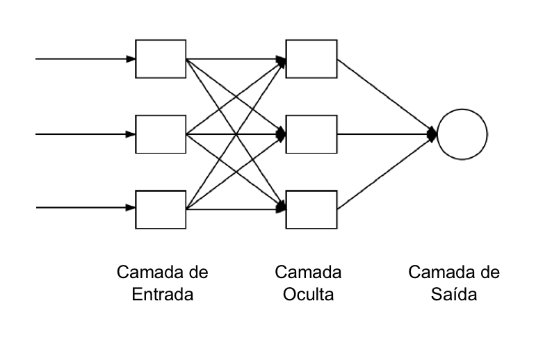
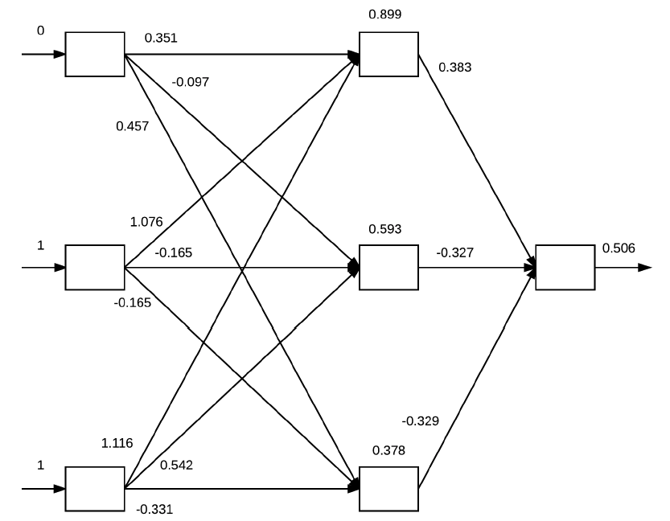
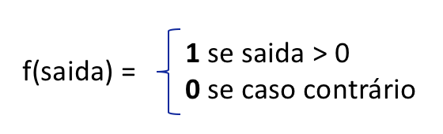

# Capítulo 15 - DeepLearnBook

<h2 style="text-align:center";>Algoritmo Backpropagation Parte 2 – Treinamento de Redes Neurais</h2>

O backpropagation é indiscutivelmente o algoritmo mais importante na história das redes neurais – sem backpropagation (eficiente), seria impossível treinar redes de aprendizagem profunda da forma que vemos hoje. O backpropagation pode ser considerado a pedra angular das redes neurais modernas e aprendizagem profunda. Neste capítulo, vamos compreender como o backpropagation é usado no treinamento das redes neurais: Algoritmo Backpropagation Parte 2 – Treinamento de Redes Neurais.

O algoritmo de backpropagation consiste em duas fases:

1. O passo para frente (forward pass), onde nossas entradas são passadas através da rede e as previsões de saída obtidas (essa etapa também é conhecida como fase de propagação).

2. O passo para trás (backward pass), onde calculamos o gradiente da função de perda na camada final (ou seja, camada de previsão) da rede e usamos esse gradiente para aplicar recursivamente a regra da cadeia (chain rule) para atualizar os pesos em nossa rede (etapa também conhecida como fase de atualização de pesos ou retro-propagação).

Vamos analisar cada uma dessas fases e compreender como funciona o backpropagation no treinamento nas redes neurais. No próximo capítulo, voltaremos ao script em Python para compreender como é a implementação do algoritmo. Let’s begin!

<h2 style="text-align:center";>Forward Pass</h2>

O propósito do passo para frente é propagar nossas entradas (os dados de entrada) através da rede aplicando uma série de dot products (multiplicação entre os vetores) e ativações até chegarmos à camada de saída da rede (ou seja, nossas previsões). Para visualizar esse processo, vamos primeiro considerar a tabela abaixo. Podemos ver que cada entrada X na matriz é 2-dim (2 dimensões), onde cada ponto de dado é representado por dois números. Por exemplo, o primeiro ponto de dado é representado pelo vetor de recursos (0, 0), o segundo ponto de dado por (0, 1), etc. Em seguida, temos nossos valores de saída Y como a coluna da direita. Nossos valores de saída são os rótulos de classe. Dada uma entrada da matriz, nosso objetivo é prever corretamente o valor de saída desejado. Em resumo, X representa as entradas e Y a saída.

Para obter uma precisão de classificação perfeita nesse problema, precisamos de uma rede neural feedforward com pelo menos uma camada oculta. Podemos então começar com uma arquitetura de 2-2-1 conforme a imagem abaixo.

Este é um bom começo, no entanto, estamos esquecendo de incluir o bias. Existem duas maneiras de incluir o bias b em nossa rede. Nós podemos:

1. Usar uma variável separada.
2. Tratar o bias como um parâmetro treinável dentro da matriz, inserindo uma coluna de 1s nos vetores de recursos.

Inserir uma coluna de 1s no nosso vetor de recursos é feito de forma programática, mas para garantir a didática, vamos atualizar nossa matriz para ver isso explicitamente, conforme tabela abaixo. Como você pode ver, uma coluna de 1s foi adicionada aos nossos vetores de recursos. Na prática você pode inserir essa coluna em qualquer lugar que desejar, mas normalmente a colocamos como a primeira entrada no vetor de recursos ou a última entrada no vetor de recursos.

Como nós mudamos o tamanho do nosso vetor de recursos de entrada (normalmente o que é realizado dentro da implementação da rede em si, para que não seja necessário modificar explicitamente a nossa matriz), isso muda nossa arquitetura de rede de 2-2-1 para uma arquitetura 3-3-1, conforme imagem abaixo. Ainda nos referimos a essa arquitetura de rede como 2-2-1, mas quando se trata de implementação, na verdade, é 3-3-1 devido à adição do termo de bias incorporado na matriz.

Finalmente, lembre-se de que tanto nossa camada de entrada quanto todas as camadas ocultas exigem um termo de bias. No entanto, a camada de saída final não requer um bias. O bias agora é um parâmetro treinável dentro da matriz de peso, tornando o treinamento mais eficiente e substancialmente mais fácil de implementar. Para ver o forward pass em ação, primeiro inicializamos os pesos em nossa rede, conforme figura abaixo. Observe como cada seta na matriz de peso tem um valor associado a ela – esse é o valor de peso atual para um determinado nó e significa o valor em que uma determinada entrada é amplificada ou diminuída. Este valor de peso será então atualizado durante a fase de backpropgation (lembre-se que ainda estamos no forward pass). Existem várias formas de inicializar o vetor de pesos e isso pode influenciar diretamente no treinamento da rede, como veremos mais abaixo.

Na extrema esquerda da figura abaixo, apresentamos o vetor de recursos (0, 1, 1) e também o valor de saída 1 para a rede, pois depois precisamos calcular os erros de previsão. Aqui podemos ver que 0,1 e 1 foram atribuídos aos três nós de entrada na rede. Para propagar os valores através da rede e obter a classificação final, nós precisamos do dot product entre as entradas e os valores de peso, seguido pela aplicação de um função de ativação (neste caso, a função sigmóide s). Vamos calcular as entradas para os três nós nas camadas ocultas:

1. s ((0 x 0.351) + (1 x 1.076) + (1 x 1.116)) = 0.899

2. s ((0 x 0.097) + (1 x 0.165)+(1 x 0.542)) = 0.593

3. s ((0x 0.457) + (1 x 0.165)+(1 x 0.331)) = 0.378

Observando os valores dos nós das camadas ocultas (camadas do meio), podemos ver que os nós foram atualizados para refletir nossa computação. Agora temos nossas entradas para os nós da camada oculta. Para calcular a previsão de saída, uma vez mais usamos o dot product seguido por uma ativação sigmóide:

s ((0.899 x 0.383) + (0.593 x – 0.327) + (0.378 x -0.329)) = 0.506

A saída da rede é, portanto, 0.506. Podemos aplicar uma função de etapa (step function) para determinar se a saída é a classificação correta ou não:

