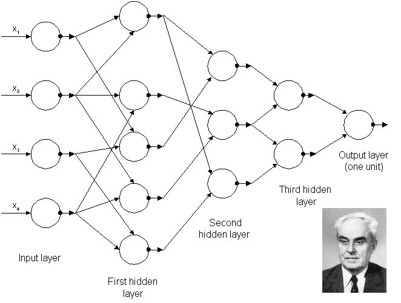
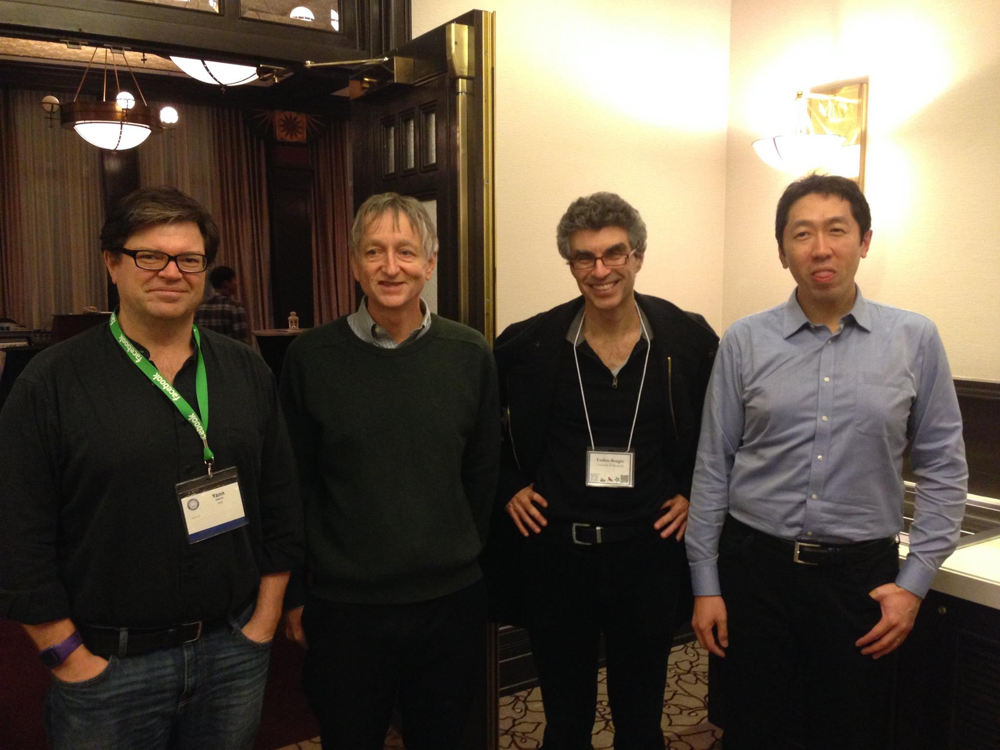

# Capítulo 2 - DeepLearBook

## O Que São Redes Neurais Artificiais Profundas ou Deep Learning?
 

Aprendizagem Profunda ou Deep Learning, é uma sub-área da Aprendizagem de Máquina, que emprega algoritmos para processar dados e imitar o processamento feito pelo cérebro humano. Mas O Que São Redes Neurais Artificiais Profundas ou Deep Learning? É o que veremos neste capítulo. Não se preocupe se alguns termos mais técnicos não fizerem sentido agora. Todos eles serão estudados ao longo deste livro online.

Deep Learning  usa camadas de neurônios matemáticos para processar dados, compreender a fala humana e reconhecer objetos visualmente. A informação é passada através de cada camada, com a saída da camada anterior fornecendo entrada para a próxima camada. A primeira camada em uma rede é chamada de camada de entrada, enquanto a última é chamada de camada de saída. Todas as camadas entre as duas são referidas como camadas ocultas. Cada camada é tipicamente um algoritmo simples e uniforme contendo um tipo de função de ativação.

>Rede Neural Simples e Rede Neural Profunda (Deep Learning)
 

A aprendizagem profunda é responsável por avanços recentes em visão computacional, reconhecimento de fala, processamento de linguagem natural e reconhecimento de áudio. 

O aprendizado profundo é baseado no conceito de redes neurais artificiais, ou sistemas computacionais que imitam a maneira como o cérebro humano funciona.

Aumento rápido e o aparente domínio do aprendizado profundo sobre os métodos tradicionais de aprendizagem de máquina em uma variedade de tarefas tem sido surpreendente de testemunhar e, às vezes, difícil de explicar. 

Deep Learning é uma evolução das Redes Neurais, que por sua vez possuem uma história fascinante que remonta à década de 1940, cheia de altos e baixos, voltas e reviravoltas, amigos e rivais, sucessos e fracassos. 

O aprendizado profundo conquistou Go, aprendeu a dirigir um carro, diagnosticou câncer de pele e autismo, tornou-se um falsificador de arte mestre e pode até alucinar imagens fotorrealistas. 

Os primeiros algoritmos de aprendizagem profunda que possuíam múltiplas camadas de características não-lineares podem ser rastreados até Alexey Grigoryevich Ivakhnenko (desenvolveu o Método do Grupo de Manipulação de Dados) e Valentin Grigor’evich Lapa (autor de Cybernetics and Forecasting Techniques) em 1965 (Figura 5), que usaram modelos finos mas profundos com funções de ativação polinomial os quais eles analisaram com métodos estatísticos. 

Eles não usaram Backpropagation para treinar a rede de ponta a ponta, mas utilizaram mínimos quadrados camada-por-camada, onde as camadas anteriores foram independentemente instaladas em camadas posteriores (um processo lento e manual).

>Fig5 – Arquitetura da primeira rede profunda conhecida treinada por Alexey Grigorevich Ivakhnenko em 1965.
 

No final da década de 1970, o primeiro inverno de AI começou, resultado de promessas que não poderiam ser mantidas. 

Em 1979, ele desenvolveu uma rede neural artificial, chamada Neocognitron, que usava um design hierárquico e multicamadas. 

Este design permitiu ao computador “aprender” a reconhecer padrões visuais. As redes se assemelhavam a versões modernas, mas foram treinadas com uma estratégia de reforço de ativação recorrente em múltiplas camadas, que ganhou força ao longo do tempo. 

Além disso, o design de Fukushima permitiu que os recursos importantes fossem ajustados manualmente aumentando o “peso” de certas conexões. O uso de conexões de cima para baixo e novos métodos de aprendizagem permitiram a realização de uma variedade de redes neurais. 

Quando mais de um padrão é apresentado ao mesmo tempo, o Modelo de Atenção Seletiva pode separar e reconhecer padrões individuais deslocando sua atenção de um para o outro (o mesmo processo que usamos em multitarefa). 

Um Neocognitron moderno não só pode identificar padrões com informações faltantes (por exemplo, um número 5 desenhado de maneira incompleta), mas também pode completar a imagem adicionando as informações que faltam. 

Filosoficamente, essa descoberta trouxe à luz a questão dentro da psicologia cognitiva de saber se a compreensão humana depende da lógica simbólica (computacionalismo) ou de representações distribuídas (conexão). 

Ele combinou redes neurais convolutivas com Backpropagation para ler os dígitos “manuscritos” (assunto do próximo capítulo).

>Fig6 – Os pioneiros da Inteligência Artificial. Da esquerda para a direita: Yann LeCun, Geoffrey Hinton, Yoshua Bengio e Andrew Ng

 

Porém, tivemos neste período o que ficou conhecido como segundo Inverno da IA, que ocorreu entre 1985-1990, que também afetou pesquisas em Redes Neurais e Aprendizagem Profunda. 

Vários indivíduos excessivamente otimistas haviam exagerado o potencial “imediato” da Inteligência Artificial, quebrando as expectativas e irritando os investidores. 

Em 1995, Dana Cortes e Vladimir Vapnik desenvolveram a máquina de vetor de suporte ou Support Vector Machine (um sistema para mapear e reconhecer dados semelhantes). 

Próximo passo evolutivo significativo para Deep Learning ocorreu em 1999, quando os computadores começaram a se tornar mais rápidos no processamento de dados e GPUs (unidades de processamento de gráfico) foram desenvolvidas. 

O uso de GPUs significou um salto no tempo de processamento, resultando em um aumento das velocidades computacionais em 1000 vezes ao longo de um período de 10 anos. 

Enquanto uma rede neural poderia ser lenta em comparação com uma máquina de vetor de suporte, as redes neurais ofereciam melhores resultados usando os mesmos dados. 

Foi descoberto que as “características” aprendidas em camadas mais baixas não eram aprendidas pelas camadas superiores, pois nenhum sinal de aprendizado alcançou essas camadas. 

Uma série de funções de ativação condensavam sua entrada, reduzindo, por sua vez, a faixa de saída de forma um tanto caótica. 

Nessas áreas de entrada, uma grande mudança será reduzida a uma pequena mudança na saída, resultando em um gradiente em queda. Duas soluções utilizadas para resolver este problema foram o pré-treino camada-a-camada e o desenvolvimento de uma memória longa e de curto prazo. 

Em 2001, um relatório de pesquisa do Grupo META (agora chamado Gartner) descreveu os desafios e oportunidades no crescimento do volume de dados. 

O relatório descreveu o aumento do volume de dados e a crescente velocidade de dados como o aumento da gama de fontes e tipos de dados. 

Em 2009, Fei-Fei Li, professora de IA em Stanford na Califórnia, lançou o ImageNet e montou uma base de dados gratuita de mais de 14 milhões de imagens etiquetadas. 

Até 2011, a velocidade das GPUs aumentou significativamente, possibilitando a formação de redes neurais convolutivas “sem” o pré-treino camada por camada. 

Com o aumento da velocidade de computação, tornou-se óbvio que Deep Learning tinha vantagens significativas em termos de eficiência e velocidade. 
Um exemplo é a AlexNet, uma rede neural convolutiva, cuja arquitetura ganhou várias competições internacionais durante 2011 e 2012. 

A Aprendizagem profunda usa “aprendizagem supervisionada”, o que significa que a rede neural convolutiva é treinada usando dados rotulados. 

Usando a aprendizagem sem supervisão, uma rede neural convolucional é alimentada com dados não marcados, e é então solicitada a busca de padrões recorrentes. 
Dez milhões de imagens “sem etiqueta” foram tiradas aleatoriamente do YouTube, mostradas ao sistema e, em seguida, o software de treinamento foi autorizado a ser executado. 

No final do treinamento, um neurônio na camada mais alta foi encontrado para responder fortemente às imagens de gatos. Isso vai gerar impacto em todas os segmentos da sociedade e aqueles que souberem trabalhar com a tecnologia, serão os líderes desse novo mundo que se apresenta diante de nós.
 

Para acessar o contéudo completo do livro, acesse: [deeplearningbook](https://www.deeplearningbook.com.br/)