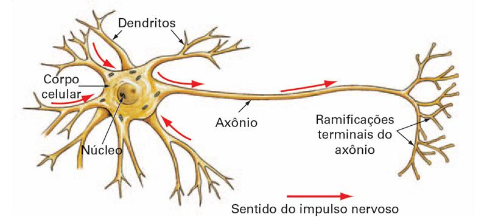
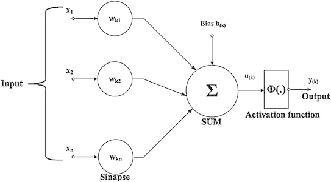
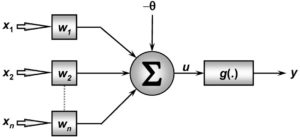

# Capítulo 4 - DeepLearBook

Para compreender a lógica de funcionamento das redes neurais, alguns conceitos básicos referentes ao funcionamento do cérebro humano e seus componentes, os neurônios, são de fundamental importância. 

A formação das conexões entre as células e algumas considerações sobre como se concebe teoricamente o funcionamento matemático, ajudam a entender as bases da aprendizagem de máquina e das redes neurais. Vejamos como funciona o neurônio biológico deixando Machine Learning de lado por um instante!

## O Neurônio Biológico

O neurônio é a unidade básica do cérebro humano, sendo uma célula especializada na transmissão de informações, pois nelas estão introduzidas propriedades de excitabilidade e condução de mensagens nervosas. O neurônio é constituído por 3 partes principais: a soma ou corpo celular, do qual emanam algumas ramificações denominadas de dendritos, e por uma outra ramificação descendente da soma, porém mais extensa, chamada de axônio. Nas extremidades dos axônios estão os nervos terminais, pelos quais é realizada a transmissão das informações para outros neurônios. Esta transmissão é conhecida como sinapse.

>Fig7 – Representação Simplificada do Neurônio Biológico

 
Os dendritos recebem sinais elétricos de outros neurônios através das sinapses, que constitui o processo de comunicação entre neurônios. 
Observe que a soma e os dendritos formam a superfície de entrada do neurônio e o axônio a superfície de saída do fluxo de informação (esse fluxo de informação é importante para compreender o neurônio matemático daqui a pouco). 

O impulso elétrico é a mensagem que os neurônios transmitem uns aos outros, ou seja, é a propagação de um estímulo ao longo dos neurônios que pode ser qualquer sinal captado pelos receptores nervosos. 
Os dendritos têm como função, receber informações, ou impulsos nervosos, oriundos de outros neurônios e conduzi-los até o corpo celular. 

Estes impulsos são transmitidos a outros neurônios, passando pelo axônio e atingindo os dendritos dos neurônios seguintes. As sinapses funcionam como válvulas, sendo capazes de controlar a transmissão de impulsos, isto é, o fluxo da informação entre os neurônios na rede neural. 

Estamos falando aqui do neurônio biológico e preste bastante atenção a palavra threshold, pois ela é a essência do neurônio matemático. Um neurônio recebe sinais através de inúmeros dendritos, os quais são ponderados e enviados para o axônio, podendo ou não seguir adiante (threshold). 

Na passagem por um neurônio, um sinal pode ser amplificado ou atenuado, dependendo do dendrito de origem, pois a cada condutor, está associado um peso pelo qual o sinal é multiplicado. Cada região do cérebro é especializada em uma dada função, como processamento de sinais auditivos, sonoros, elaboração de pensamentos, desejos, etc… Esse processamento se dá através de redes particulares interligadas entre si, realizando processamento paralelo. 

Cada região do cérebro possui uma arquitetura de rede diferente: varia o número de neurônios, de sinapses por neurônio, valor dos thresholds e dos pesos, etc…Os valores dos pesos são estabelecidos por meio de treinamento recebido pelo cérebro durante a vida útil. 

partir da estrutura e funcionamento do neurônio biológico, pesquisadores tentaram simular este sistema em computador. Em termos simples, um neurônio matemático de uma rede neural artificial é um componente que calcula a soma ponderada de vários inputs, aplica uma função e passa o resultado adiante. 

Neste modelo de neurônio matemático, os impulsos elétricos provenientes de outros neurônios são representados pelos chamados sinais de entrada (a letra x nesse diagrama abaixo, que nada mais são do que os dados que alimentam seu modelo de rede neural artificial). 

Dentre os vários estímulos recebidos, alguns excitarão mais e outros menos o neurônio receptor e essa medida de quão excitatório é o estímulo é representada no modelo de Warren McCulloch e Walter Pitts através dos pesos sinápticos. 

Os pesos sinápticos são representados por wkn neste diagrama abaixo, onde k representa o índice do neurônio em questão e n se refere ao terminal de entrada da sinapse a qual o peso sináptico se refere. 
soma ou corpo da célula é representada por uma composição de dois módulos, o primeiro é uma junção aditiva, somatório dos estímulos (sinais de entrada) multiplicado pelo seu fator excitatório (pesos sinápticos), e posteriormente uma função de ativação, que definirá com base nas entradas e pesos sinápticos, qual será a saída do neurônio. 

Assim como no modelo biológico, o estímulo pode ser excitatório ou inibitório, representado pelo peso sináptico positivo ou negativo respectivamente.

>Fig8 – Representação Simplificada do Neurônio Matemático

 

O modelo proposto possui uma natureza binária. Tanto os sinais de entrada quanto a saída, são valores binários. McCulloch acreditava que o funcionamento do sistema nervoso central possuía um carater binário, ou seja, um neurônio infuencia ou não outro neurônio, mas posteriormente mostrou-se que não era dessa forma.

O neurônio matemático é um modelo simplificado do neurônio biológico. Tais modelos inspirados a partir da análise da geração e propagação de impulsos elétricos pela membrana celular dos neurônios. 

O neurônio matemático recebe um ou mais sinais de entrada e devolve um único sinal de saída, que pode ser distribuído como sinal de saída da rede, ou como sinal de entrada para um ou vários outros neurônios da camada posterior (que formam a rede neural artificial).

 Os dendritos e axônios são representados matematicamente apenas pelas sinapses, e a intensidade da ligação é representada por uma grandeza denominada peso sináptico, simbolizada pela letra w. Quando as entradas, x são apresentadas ao neurônio, elas são multiplicadas pelos pesos sinápticos correspondentes, gerando as entradas ponderadas, ou seja, x1 que multiplica w1, etc… 
 Isso descreve uma das bases matemáticas do funcionamento de uma rede neural artificial, a multiplicação de matrizes:

 
 >Fig9 – Multiplicação de Matrizes Entre Sinais de Entrada x e Pesos Sinápticos w (versão simplificada)

  

 O neurônio então totaliza todos os produtos gerando um único resultado. A esta função se denomina função de combinação. Este valor é então apresentado a uma função de ativação ou função de transferência, que tem, dentre outras, a finalidade de evitar o acréscimo progressivo dos valores de saída ao longo das camadas da rede, visto que tais funções possuem valores máximos e mínimos contidos em intervalos determinados. 
 
 O uso de funções de transferência não-lineares torna a rede neural uma ferramenta poderosa. Sabe-se que uma rede perceptron de duas camadas com função de transferência não-linear como a função sigmóide (que veremos mais adiante), é denominada de aproximador universal.

Um neurônio dispara quando a soma dos impulsos que ele recebe ultrapassa o seu limiar de excitação chamado de threshold. O corpo do neurônio, por sua vez, é emulado por um mecanismo simples que faz a soma dos valores xi e wi recebidos pelo neurônio (soma ponderada) e decide se o neurônio deve ou não disparar (saída igual a 1 ou a 0) comparando a soma obtida ao limiar ou threshold do neurônio.

A ativação do neurônio é obtida através da aplicação de uma “função de ativação”, que ativa a saída ou não, dependendo do valor da soma ponderada das suas entradas.

Note que este modelo matemático simplificado de um neurônio é estático, ou seja, não considera a dinâmica do neurônio natural. 
No neurônio biológico, os sinais são enviados em pulsos e alguns componentes dos neurônios biológicos, a exemplo do axônio, funcionam como filtros de frequência.

O modelo do neurônio matemático também pode incluir uma polarização ou bias de entrada. Esta variável é incluída ao somatório da função de ativação, com o intuito de aumentar o grau de liberdade desta função e, consequentemente, a capacidade de aproximação da rede. 

O valor do bias é ajustado da mesma forma que os pesos sinápticos. O bias possibilita que um neurônio apresente saída não nula ainda que todas as suas entradas sejam nulas. 
Por exemplo, caso não houvesse o bias e todas as entradas de um neurônio fossem nulas, então o valor da função de ativação seria nulo. Desta forma não poderíamos, por exemplo, fazer com o que o neurônio aprendesse a relação pertinente ao ”ou exclusivo” da lógica. 
Em resumo, temos esses componentes em um neurônio matemático:

>Fig10 – Representação do Neurônio Matemático

 

- Sinais de entrada { X1, X2, …, Xn }: São os sinais externos normalmente normalizados para incrementar a eficiência computacional dos algoritmos de aprendizagem. São os dados que alimentam seu modelo preditivo.
  
- Pesos sinápticos { W1, W2, …, Wn }: São valores para ponderar os sinais de cada entrada da rede. Esses valores são aprendidos durante o treinamento.

- Combinador linear { Σ }: Agregar todos sinais de entrada que foram ponderados pelos respectivos pesos sinápticos a fim de produzir um potencial de ativação.

- Limiar de ativação { Θ }: Especifica qual será o patamar apropriado para que o resultado produzido pelo combinador linear possa gerar um valor de disparo de ativação.

- Potencial de ativação { u }: É o resultado obtido pela diferença do valor produzido entre o combinador linear e o limiar de ativação. Se o valor for positivo, ou seja, se u ≥ 0 então o neurônio produz um potencial excitatório; caso contrário, o potencial será inibitório.

- Função de ativação { g }: Seu objetivo é limitar a saída de um neurônio em um intervalo valores.
Sinal de saída { y}: É o valor final de saída podendo ser usado como entrada de outros neurônios que estão sequencialmente interligados.

Os modelos baseados em redes neurais artificiais são os que mais ganharam atenção nos últimos anos por conseguirem resolver problemas de IA nos quais se conseguia pouco avanço com outras técnicas. A partir da concepção do neurônio matemático, várias arquiteturas e modelos com diferentes combinações entre esses neurônios, e aplicando diferentes técnicas matemáticas e estatísticas, surgiram e propiciaram a criação de arquiteturas avançadas de Deep Learning como Redes Neurais Convolucionais, Redes Neurais Recorrentes, Auto Encoders, Generative Adversarial Networks, Memory Networks, entre outras, que estudaremos ao longo deste livro online.

 

_Referências:_
- [Anatomia de um Neurônio](https://pt.khanacademy.org/science/biology/human-biology/neuron-nervous-system/v/anatomy-of-a-neuron)
  
- [Bibliografia Machine Learning e IA](https://arxiv.org/abs/1404.7828)

- [Deep Learning in Neural Networks: An Overview](https://arxiv.org/abs/1404.7828)

- [Grokking Deep Learning](https://www.manning.com/books/grokking-deep-learning)

- HAYKIN, S. Redes Neurais, princípios e práticas. Porto Alegre: Bookman, 2001.

- JAIN, A. K, MAO, J., MOHIUDDIN, K.M. Artificial neural networks: a tutorial. IEEE Computer, v. 29, n. 3, p. 56-63, 1996.

Para acessar o contéudo completo do livro, acesse: [deeplearningbook](https://www.deeplearningbook.com.br/)

