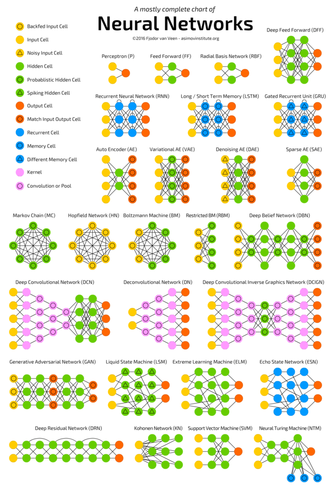
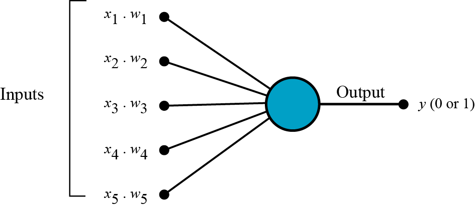

# Capítulo 6 - DeepLearnBook

## O Perceptron – Parte 1

Você sabe quais são as principais arquiteturas de redes neurais artificias? Não. Então analise cuidadosamente a imagem abaixo (excelente trabalho criado pela equipe do Asimov Institute, cujo link você encontra na seção de referências ao final deste capítulo):

Incrível, não? São diversas arquiteturas, usadas para resolver diferentes tipos de problemas, como por exemplo as arquiteturas de redes neurais convolucionais usadas em problemas de Visão Computacional e as redes neurais recorrentes usadas em problemas de Processamento de Linguagem Natural. Estudaremos quase todas essas arquiteturas aqui neste livro. Sim, isso mesmo que você leu. 

Embora todas essas arquiteturas sejam de redes neurais artificias, nem todas são de Deep Learning. O que caracteriza modelos de aprendizagem profunda, como o nome sugere, são redes neurais artificias com muitas camadas ocultas (ou intermediárias).

Mas antes de chegarmos lá, precisamos passar pela arquitetura mais simples de uma rede neural artificial, o Perceptron. Como diz o ditado: “Toda grande caminhada começa pelo primeiro passo”.

O Modelo Perceptron foi desenvolvido nas décadas de 1950 e 1960 pelo cientista Frank Rosenblatt, inspirado em trabalhos anteriores de Warren McCulloch e Walter Pitts. 
Hoje, é mais comum usar outros modelos de neurônios artificiais, mas o Perceptron permite uma compreensão clara de como funciona uma rede neural em termos matemáticos, sendo uma excelente introdução.

Então, como funcionam os Perceptrons? Um Perceptron é um modelo matemático que recebe várias entradas, x1, x2, … e produz uma única saída binária:

 
No exemplo mostrado, o Perceptron possui três entradas: x1, x2, x3. Rosenblatt propôs uma regra simples para calcular a saída. Ele introduziu pesos, w1, w2, …, números reais expressando a importância das respectivas entradas para a saída. A saída do neurônio, 0 ou 1, é determinada pela soma ponderada, Σjwjxj, menor ou maior do que algum valor limiar (threshold). Assim como os pesos, o threshold é um número real que é um parâmetro do neurônio. Para colocá-lo em termos algébricos mais precisos:

 
Esse é o modelo matemático básico. Uma maneira de pensar sobre o Perceptron é que é um dispositivo que toma decisões ao comprovar evidências. Deixe-me dar um exemplo. Não é um exemplo muito realista, mas é fácil de entender, e logo chegaremos a exemplos mais realistas.

 Suponha que o fim de semana esteja chegando e você ouviu falar que haverá um festival de queijo em sua cidade. Você gosta de queijo e está tentando decidir se deve ou não ir ao festival. Você pode tomar sua decisão pesando três fatores:

O tempo está bom?
Seu namorado ou namorada quer acompanhá-lo(a)?
O festival está perto de transporte público? (Você não possui um carro)

Podemos representar estes três fatores pelas variáveis binárias correspondentes x1, x2 e x3. Por exemplo, teríamos x1 = 1 se o tempo estiver bom e x1 = 0 se o tempo estiver ruim. Da mesma forma, x2 = 1 se seu namorado ou namorada quiser ir ao festival com você, e x2 = 0, se não. E similarmente para x3 e transporte público.

Agora, suponha que você adore queijo e está disposto a ir ao festival, mesmo que seu namorado ou namorada não esteja interessado e o festival fica em um lugar de difícil acesso e sem transporte público amplamente disponível.

 Além disso, você realmente detesta mau tempo, e não há como ir ao festival se o tempo estiver ruim. Você pode usar Perceptrons para modelar esse tipo de tomada de decisão.

Uma maneira de fazer isso é escolher um peso w1 = 6 para o tempo e w2 = 2 e w3 = 2 para as outras condições. O valor maior de w1 indica que o tempo é muito importante para você, muito mais do que se seu namorado ou namorada vai acompanhá-lo(a) ou se o festival é próximo do transporte público. 

Finalmente, suponha que você escolha um threshold de 5 para o Perceptron. Com essas escolhas, o Perceptron implementa o modelo de tomada de decisão desejado, produzindo 1 sempre que o tempo estiver bom e 0 sempre que o tempo estiver ruim. Não faz diferença para o resultado se seu namorado ou namorada quer ir, ou se o transporte público está acessível.

Variando os pesos e o limiar, podemos obter diferentes modelos de tomada de decisão. Por exemplo, suponha que escolhemos um threshold de 3. Então, o Perceptron decidirá que você deveria ir ao festival sempre que o tempo estiver bom ou quando o festival estiver perto do transporte público e seu namorado ou namorada estiver disposto a se juntar a você.

Em outras palavras, seria um modelo diferente de tomada de decisão. Reduzir o threshold significa que você está mais propenso a ir ao festival.

Obviamente, o Perceptron não é um modelo completo de tomada de decisão humana! Mas o que o exemplo ilustra é como um Perceptron pode pesar diferentes tipos de evidências para tomar decisões. 
E deve parecer plausível que uma rede complexa de Perceptrons possa tomar decisões bastante sutis.

 

Nesta rede, a primeira coluna de Perceptrons – o que chamaremos de primeira camada de Perceptrons – está tomando três decisões muito simples, pesando a evidência de entrada. E quanto aos Perceptrons na segunda camada? Cada um desses Perceptrons está tomando uma decisão ponderando os resultados da primeira camada de tomada de decisão. Desta forma, um Perceptron na segunda camada pode tomar uma decisão em um nível mais complexo e mais abstrato do que os Perceptrons na primeira camada. E as decisões ainda mais complexas podem ser feitas pelos Perceptrons na terceira camada. Desta forma, uma rede de Perceptrons de várias camadas pode envolver-se em uma tomada de decisão sofisticada.

Aliás, quando definimos os Perceptrons, dissemos que um Perceptron possui apenas uma saída. Na rede acima, os Perceptrons parecem ter múltiplos resultados. Na verdade, eles ainda são de saída única. As setas de saída múltiplas são meramente uma maneira útil de indicar que a saída de um Perceptron está sendo usada como entrada para vários outros Perceptrons.

Vamos simplificar a maneira como descrevemos os Perceptrons. No limite de condição Σjwjxj > threshold podemos fazer duas mudanças de notação para simplificá-lo. A primeira mudança é escrever Σjwjxj como um produto (dot product), w⋅x≡Σjwjxj, onde w e x são vetores cujos componentes são os pesos e entradas, respectivamente. A segunda mudança é mover o threshold para o outro lado da equação e substituí-lo pelo que é conhecido como o viés (bias) do Perceptron, ou b ≡ -threshold. Usando o viés em vez do threshold, a regra Perceptron pode ser reescrita:

Você pode pensar no viés como uma medida de quão fácil é obter o Perceptron para produzir um 1. Ou para colocá-lo em termos mais biológicos, o viés é uma medida de quão fácil é fazer com que o Perceptron dispare. Para um Perceptron com um viés realmente grande, é extremamente fácil para o Perceptron emitir um 1. Mas se o viés é muito negativo, então é difícil para o Perceptron emitir um 1. Obviamente, a introdução do viés é apenas uma pequena mudança em como descrevemos Perceptrons, mas veremos mais adiante que isso leva a outras simplificações de notação. Por isso, no restante do livro, não usaremos o threshold, usaremos sempre o viés.

Agora começa a ficar mais fácil compreender o conceito por trás das redes neurais artificiais e isso será muito útil quando estudarmos arquiteturas mais avançadas! Um Perceptron segue o modelo “feed-forward”, o que significa que as entradas são enviadas para o neurônio, processadas e resultam em uma saída. No diagrama abaixo, isso significa que a rede (um neurônio) lê da esquerda para a direita.

 

O processo de treinamento de um modelo Perceptron consiste em fazer com que o modelo aprenda os valores ideais de pesos e bias. Apresentamos ao modelo os dados de entrada e as possíveis saídas, treinamos o modelo e pesos e bias são aprendidos. Com o modelo treinado, podemos apresentar novos dados de entrada e o modelo será capaz de prever a saída. Veremos isso em breve quando criarmos nosso primeiro modelo usando linguagem Python.

Perceptron é uma rede neural de camada única e um Perceptron de várias camadas é chamado de Rede Neural Artificial. O Perceptron é um classificador linear (binário). Além disso, é usado na aprendizagem supervisionada e pode ser usado para classificar os dados de entrada fornecidos.

Mas o Perceptron tem ainda outras características importantes, como a representação de condicionais lógicos (and, or, xor), problemas com dados não linearmente separáveis e as funções de ativação. Mas esses são temas para o próximo capítulo. Até lá!

_Referências:_

- [The Neural Network Zoo](http://www.asimovinstitute.org/neural-network-zoo/)

- [Machine Learning](https://www.amazon.com.br/Machine-Learning-Tom-M-Mitchell/dp/0070428077/ref=sr_1_fkmr0_1?ie=UTF8&qid=1482129989&sr=8-1-fkmr0&keywords=Machine+Learning+%28McGraw-Hill+International+Editions+Computer+Science+Series%29)

- [The Elements of Statistical Learning: Data Mining, Inference, and Prediction, Second Edition](https://www.amazon.com.br/Elements-Statistical-Learning-Prediction-Statistics-ebook/dp/B00475AS2E/ref=sr_1_1?ie=UTF8&qid=1482130176&sr=8-1&keywords=The+Elements+of+Statistical+Learning%3A+Data+Mining%2C+Inference%2C+and+Prediction%2C+Second+Edition)

- [Pattern Recognition and Machine Learning](https://www.amazon.com.br/Pattern-Recognition-Machine-Learning-Christopher/dp/0387310738/ref=sr_1_1?ie=UTF8&qid=1482130309&sr=8-1&keywords=Pattern+Recognition+and+Machine+Learning)

- [Redes Neurais, princípios e práticas](https://www.amazon.com.br/Redes-Neurais-Princ%C3%ADpios-e-Pr%C3%A1tica-ebook/dp/B073QSG69Y/ref=tmm_kin_swatch_0?_encoding=UTF8&qid=1516302804&sr=1-1)

 

- [Neural Networks and Deep Learning ](http://neuralnetworksanddeeplearning.com/) - (alguns trechos extraídos e traduzidos com autorização do autor)  [Michael Nielsen](http://michaelnielsen.org/)

Para acessar o contéudo completo do livro, acesse: [deeplearningbook](https://www.deeplearningbook.com.br/)