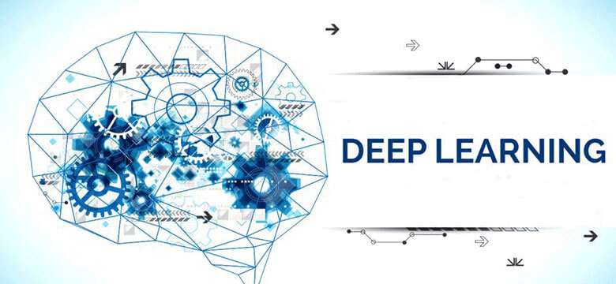
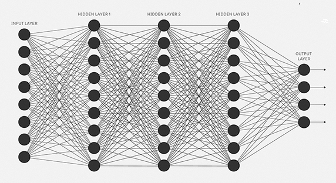
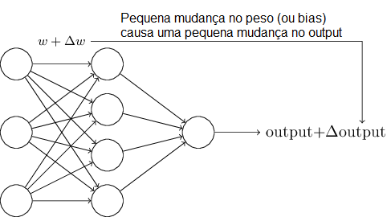
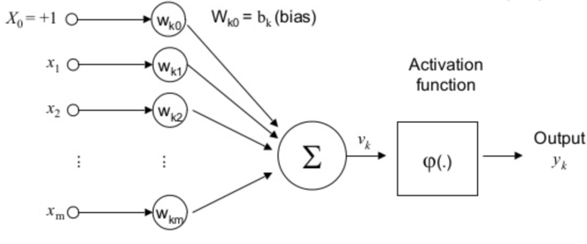

# Capítulo 8 - DeepLearnBook

## Função de Ativação

Neste capítulo estudaremos um importante componente de uma rede neural artificial, a Função de Ativação. Este capítulo é uma introdução ao tema e voltaremos a ele mais adiante quando estudarmos as arquiteturas avançadas de  [Deep Learning](https://www.deeplearningbook.com.br/capitulo-1-deep-learning-a-tempestade-perfeita) . Este capítulo pode ser um pouco desafiador, pois começaremos a introduzir conceitos mais avançados, que serão muito úteis na sequência dos capítulos. Relaxe, faça a leitura e aprenda um pouco mais sobre redes neurais artificiais.

Antes de mergulhar nos detalhes das funções de ativação, vamos fazer uma pequena revisão do que são redes [neurais artificiais](https://www.deeplearningbook.com.br/capitulo-3-o-que-sao-redes-neurais-artificiais-profundas/) e como funcionam. Uma rede neural é um mecanismo de aprendizado de máquina (Machine Learning) muito poderoso que imita basicamente como um cérebro humano aprende. O cérebro recebe o estímulo do mundo exterior, faz o processamento e gera o resultado. 
À medida que a tarefa se torna complicada, vários neurônios formam uma rede complexa, transmitindo informações entre si. Usando uma rede neural artificial, tentamos imitar um comportamento semelhante. A rede que você vê abaixo é uma rede neural artificial composta de neurônios interligados.

Os círculos negros na imagem acima são neurônios. Cada neurônio é caracterizado pelo peso, bias e a função de ativação. Os dados de entrada são alimentados na camada de entrada. Os neurônios fazem uma transformação linear na entrada pelos pesos e bias. A transformação não linear é feita pela função de ativação. 

A informação se move da camada de entrada para as camadas ocultas. As camadas ocultas fazem o processamento e enviam a saída final para a camada de saída. Este é o movimento direto da informação conhecido como propagação direta. Mas e se o resultado gerado estiver longe do valor esperado? Em uma rede neural, atualizaríamos os pesos e bias dos neurônios com base no erro. Este processo é conhecido como backpropagation. Uma vez que todos os dados passaram por este processo, os pesos e bias finais são usados para previsões.

Calma, calma, calma. Muita informação em um único parágrafo, eu sei! Vamos por partes. As entradas, os pesos e bias nós já discutimos nos capítulos anteriores. A função de ativação vamos discutir agora e a propagação direta e o backpropagation discutimos nos próximos capítulos!

<h2>Função de Ativação</h2>

Os algoritmos de aprendizagem são fantásticos. Mas como podemos elaborar esses algoritmos para uma rede neural artificial? Suponhamos que tenhamos uma rede de Perceptrons que gostaríamos de usar para aprender a resolver algum problema. 
Por exemplo, as entradas para a rede poderiam ser os dados de pixel de uma imagem digitalizada, escrita à mão, de um dígito. Gostaríamos que a rede aprendesse pesos e bias para que a saída da rede classifique corretamente o dígito. 
Para ver como a aprendizagem pode funcionar, suponha que façamos uma pequena alteração em algum peso (ou bias) na rede. O que queremos é que esta pequena mudança de peso cause apenas uma pequena alteração correspondente na saída da rede. 

Como veremos em um momento, esta propriedade tornará possível a aprendizagem. Esquematicamente, aqui está o que queremos (obviamente, esta rede é muito simples para fazer reconhecimento de escrita, mas fique tranquilo que veremos redes bem mais complexas).

Se fosse verdade que uma pequena alteração em um peso (ou bias) fizesse com que tivéssemos apenas uma pequena alteração no resultado, então poderíamos usar esse fato para modificar os pesos e os valores de bias para que a nossa rede se comporte mais da maneira que queremos. 

Por exemplo, suponha que a rede classificasse equivocadamente uma imagem como “8” quando deveria ser um “9”. Podemos descobrir como fazer uma pequena mudança nos pesos e bias para que a rede fique um pouco mais próxima da classificação da imagem como “9”. 
E então, repetiríamos isso, mudando os pesos e os valores de bias repetidamente para produzir melhor e melhor resultado. A rede estaria aprendendo.

O problema é que isso não é o que acontece quando nossa rede contém apenas Perceptrons, conforme estudamos nos capítulos anteriores. De fato, uma pequena alteração nos pesos de um único Perceptron na rede pode, por vezes, fazer com que a saída desse Perceptron mude completamente, digamos de 0 a 1. 

Essa mudança pode então causar o comportamento do resto da rede mudar completamente de uma maneira muito complicada. Então, enquanto o seu “9” pode agora ser classificado corretamente, o comportamento da rede em todas as outras imagens provavelmente mudará completamente de maneira difícil de controlar. Talvez haja uma maneira inteligente de resolver esse problema. Sim, há. E é conhecida como função de ativação.

Podemos superar esse problema através da introdução de um componente matemático em nosso neurônio artificial, chamado função de ativação. As funções de ativação permitem que pequenas mudanças nos pesos e bias causem apenas uma pequena alteração no output. Esse é o fato crucial que permitirá que uma rede de neurônios artificiais aprenda.

Vejamos como isso funciona:

As funções de ativação são um elemento extremamente importante das redes neurais artificiais. Elas basicamente decidem se um neurônio deve ser ativado ou não. Ou seja, se a informação que o neurônio está recebendo é relevante para a informação fornecida ou deve ser ignorada. Veja na fórmula abaixo como a função de ativação é mais uma camada matemática no processamento.

A função de ativação é a transformação não linear que fazemos ao longo do sinal de entrada. Esta saída transformada é então enviada para a próxima camada de neurônios como entrada. Quando não temos a função de ativação, os pesos e bias simplesmente fazem uma transformação linear. 

Uma equação linear é simples de resolver, mas é limitada na sua capacidade de resolver problemas complexos. Uma rede neural sem função de ativação é essencialmente apenas um modelo de regressão linear. A função de ativação faz a transformação não-linear nos dados de entrada, tornando-o capaz de aprender e executar tarefas mais complexas. 

Queremos que nossas redes neurais funcionem em tarefas complicadas, como traduções de idiomas (Processamento de Linguagem Natural) e classificações de imagens (Visão Computacional). As transformações lineares nunca seriam capazes de executar tais tarefas.

As funções de ativação tornam possível a propagação posterior desde que os gradientes sejam fornecidos juntamente com o erro para atualizar os pesos e bias. Sem a função não linear diferenciável, isso não seria possível. 
Caso o termo gradiente não seja familiar, aguarde os próximos capítulos, quando vamos explicar este conceito em detalhes, visto que ele é a essência do processo de aprendizagem em redes neurais artificiais.

Mas não existe apenas um tipo de função de ativação. Na verdade existem vários, cada qual a ser usado em diferentes situações. Vamos a uma breve descrição dos tipos mais populares.

## Tipos Populares de Funções de Ativação

A função de ativação é um componente matemático incluído na estrutura de redes neurais artificiais a fim de permitir a solução de problemas complexos. Existem diversos tipos de funções de ativação e esta é uma área de pesquisa ativa, à medida que a Inteligência Artificial evolui (não é maravilhoso estar participando desta evolução, que vai transformar completamente o mundo?). Vejamos quais são os tipos mais populares.

### Função de Etapa Binária (Binary Step Function)

A primeira coisa que vem à nossa mente quando temos uma função de ativação seria um classificador baseado em limiar (threshold), ou seja, se o neurônio deve ou não ser ativado. Se o valor Y estiver acima de um valor de limite determinado, ative o neurônio senão deixa desativado. Simples! Essa seria a regra:

**f(x) = 1, x>=0**

**f(x) = 0, x<0**

A função de etapa binária é isso mesmo, extremamente simples. Ela pode ser usada ao criar um classificador binário. Quando simplesmente precisamos dizer sim ou não para uma única classe, a função de etapa seria a melhor escolha, pois ativaria o neurônio ou deixaria zero.

A função é mais teórica do que prática, pois, na maioria dos casos, classificamos os dados em várias classes do que apenas uma única classe. A função de etapa não seria capaz de fazer isso.

Além disso, o gradiente da função de etapa é zero. Isso faz com que a função de etapa não seja tão útil durante o backpropagation quando os gradientes das funções de ativação são enviados para cálculos de erro para melhorar e otimizar os resultados. O gradiente da função de etapa reduz tudo para zero e a melhoria dos modelos realmente não acontece. Lembrando, mais uma vez, que veremos em detalhes os conceitos de gradiente e backpropagation mais adiante, nos próximos capítulos!

### Função Linear

Nós vimos o problema com a função step, o gradiente sendo zero, é impossível atualizar o gradiente durante a backpropagation. Em vez de uma função de passo simples, podemos tentar usar uma função linear. Podemos definir a função como:

**f(x) = ax**

A derivada de uma função linear é constante, isto é, não depende do valor de entrada x. Isso significa que toda vez que fazemos backpropagation, o gradiente seria o mesmo. E este é um grande problema, não estamos realmente melhorando o erro, já que o gradiente é praticamente o mesmo. E não apenas suponha que estamos tentando realizar uma tarefa complicada para a qual precisamos de múltiplas camadas em nossa rede. 

Agora, se cada camada tiver uma transformação linear, não importa quantas camadas nós tenhamos, a saída final não é senão uma transformação linear da entrada. Portanto, a função linear pode ser ideal para tarefas simples, onde a interpretabilidade é altamente desejada.

### Sigmóide

Sigmóide é uma função de ativação amplamente utilizada. É da forma:

**f (x) = 1 / (1 + e ^ -x)**

Esta é uma função suave e é continuamente diferenciável. A maior vantagem sobre a função de etapa e a função linear é que não é linear. Esta é uma característica incrivelmente interessante da função sigmóide. 
Isto significa essencialmente que quando eu tenho vários neurônios com função sigmóide como função de ativação – a saída também não é linear. A função varia de 0 a 1 tendo um formato S.

A função essencialmente tenta empurrar os valores de Y para os extremos. Esta é uma qualidade muito desejável quando tentamos classificar os valores para uma classe específica.

A função sigmóide ainda é amplamente utilizada até hoje, mas ainda temos problemas que precisamos abordar. Com a sigmóide temos problemas quando os gradientes se tornam muito pequenos. Isso significa que o gradiente está se aproximando de zero e a rede não está realmente aprendendo.

Outro problema que a função sigmóide sofre é que os valores variam apenas de 0 a 1. Esta medida que a função sigmóide não é simétrica em torno da origem e os valores recebidos são todos positivos. 
Nem sempre desejamos que os valores enviados ao próximo neurônio sejam todos do mesmo sinal. Isso pode ser abordado pela ampliação da função sigmóide. Isso é exatamente o que acontece na função tanh.

### Tanh

A função tanh é muito semelhante à função sigmóide. Na verdade, é apenas uma versão escalonada da função sigmóide.

**Tanh (x) = 2sigmoides (2x) -1**

Pode ser escrito diretamente como:

**tanh (x) = 2 / (1 + e ^ (- 2x)) -1**

Tanh funciona de forma semelhante à função sigmóide, mas sim simétrico em relação à origem. varia de -1 a 1.

Basicamente, soluciona o nosso problema dos valores, sendo todos do mesmo sinal. Todas as outras propriedades são as mesmas da função sigmoide. É contínuo e diferenciável em todos os pontos. A função não é linear, então podemos fazer o backpropagation facilmente nos erros.

### ReLU

A função ReLU é a unidade linear rectificada. É definida como:

**f(x) = max (0, x)**

ReLU é a função de ativação mais amplamente utilizada ao projetar redes neurais atualmente. Primeiramente, a função ReLU é não linear, o que significa que podemos facilmente copiar os erros para trás e ter várias camadas de neurônios ativados pela função ReLU.

A principal vantagem de usar a função ReLU sobre outras funções de ativação é que ela não ativa todos os neurônios ao mesmo tempo. O que isto significa ? Se você olhar para a função ReLU e a entrada for negativa, ela será convertida em zero e o neurônio não será ativado. Isso significa que, ao mesmo tempo, apenas alguns neurônios são ativados, tornando a rede esparsa e eficiente e fácil para a computação.

Mas ReLU também pode ter problemas com os gradientes que se deslocam em direção a zero. Mas quando temos um problema, sempre podemos pensar em uma solução. Aliás, isso é o que as empresas mais procuram nos dias de hoje: “resolvedores de problemas”. Seja um e sua empregabilidade estará garantida!

### Leaky ReLU
A função Leaky ReLU não passa de uma versão melhorada da função ReLU. Na função ReLU, o gradiente é 0 para x < 0, o que fez os neurônios morrerem por ativações nessa região. Leaky ReLU ajuda a resolver este problema. Em vez de definir a função Relu como 0 para x inferior a 0, definimos como um pequeno componente linear de x. Pode ser definido como:

**f(x) = ax, x < 0**
**f(x) = x, x > = 0**

O que fizemos aqui é que simplesmente substituímos a linha horizontal por uma linha não-zero, não horizontal. Aqui um é um valor pequeno como 0,01 ou algo parecido. A principal vantagem de substituir a linha horizontal é remover o gradiente zero.

### Softmax

A função softmax também é um tipo de função sigmóide, mas é útil quando tentamos lidar com problemas de classificação. A função sigmóide como vimos anteriormente é capaz de lidar com apenas duas classes. O que devemos fazer quando estamos tentando lidar com várias classes? 
Apenas classificar sim ou não para uma única classe não ajudaria. A função softmax transforma as saídas para cada classe para valores entre 0 e 1 e também divide pela soma das saídas. Isso essencialmente dá a probabilidade de a entrada estar em uma determinada classe. Pode ser definido como:

Digamos, por exemplo, que temos as saídas como [1.2, 0.9, 0.75], quando aplicamos a função softmax, obteríamos [0.42, 0.31, 0.27]. Então, agora podemos usá-los como probabilidades de que o valor seja de cada classe.

A função softmax é idealmente usada na camada de saída do classificador, onde realmente estamos tentando gerar as probabilidades para definir a classe de cada entrada.

### Escolhendo a Função de Ativação Correta

Agora que já vimos tantas funções de ativação, precisamos de alguma lógica/heurística para saber qual função de ativação deve ser usada em qual situação. Não há uma regra de ouro e a escolha depende do problema no qual você estiver trabalhando.

No entanto, dependendo das propriedades do problema, poderemos fazer uma melhor escolha para uma convergência fácil e rápida da rede neural.

- Funções Sigmóide e suas combinações geralmente funcionam melhor no caso de classificadores.
- Funções Sigmóide e Tanh às vezes são evitadas devido ao problema de Vanishing Gradient (que estudaremos no capítulo sobre redes neurais recorrentes).
- A função ReLU é uma função de ativação geral e é usada na maioria dos casos atualmente.
- Se encontrarmos um caso de neurônios deficientes em nossas redes, a função Leaky ReLU é a melhor escolha.
- Tenha sempre em mente que a função ReLU deve ser usada apenas nas camadas ocultas.
- Como regra geral, você pode começar usando a função ReLU e depois passar para outras funções de ativação no caso da ReLU não fornecer resultados ótimos.
  
Está começando a sentir a vibração em trabalhar com Inteligência Artificial? Então continue acompanhando, pois estamos apenas no começo! Até o próximo capítulo!

**_Referências:_**

[Função Sigmóide](https://pt.wikipedia.org/wiki/Fun%C3%A7%C3%A3o_sigm%C3%B3ide)

[Machine Learning](https://www.amazon.com.br/Machine-Learning-Tom-M-Mitchell/dp/0070428077/ref=sr_1_fkmr0_1?ie=UTF8&qid=1482129989&sr=8-1-fkmr0&keywords=Machine+Learning+%28McGraw-Hill+International+Editions+Computer+Science+Series%29)

[The Elements of Statistical Learning: Data Mining, Inference, and Prediction, Second Edition](https://www.amazon.com.br/Elements-Statistical-Learning-Prediction-Statistics-ebook/dp/B00475AS2E/ref=sr_1_1?ie=UTF8&qid=1482130176&sr=8-1&keywords=The+Elements+of+Statistical+Learning%3A+Data+Mining%2C+Inference%2C+and+Prediction%2C+Second+Edition)

[Pattern Recognition and Machine Learning](https://www.amazon.com.br/Pattern-Recognition-Machine-Learning-Christopher/dp/0387310738/ref=sr_1_1?ie=UTF8&qid=1482130309&sr=8-1&keywords=Pattern+Recognition+and+Machine+Learning)

[Understanding Activation Functions in Neural Networks](https://medium.com/the-theory-of-everything/understanding-activation-functions-in-neural-networks-9491262884e0)

[Vanishing Gradient Problem](https://en.wikipedia.org/wiki/Vanishing_gradient_problem)

[Redes Neurais, princípios e práticas](https://www.amazon.com.br/Redes-Neurais-Princ%C3%ADpios-e-Pr%C3%A1tica-ebook/dp/B073QSG69Y/ref=tmm_kin_swatch_0?_encoding=UTF8&qid=1516302804&sr=1-1)

[Neural Networks and Deep Learning ](http://neuralnetworksanddeeplearning.com/) - (alguns trechos extraídos e traduzidos com autorização do autor)  [Michael Nielsen](http://michaelnielsen.org/)

Para acessar o contéudo completo do livro, acesse: [deeplearningbook](https://www.deeplearningbook.com.br/)
