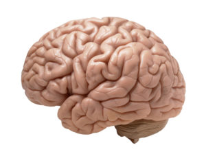
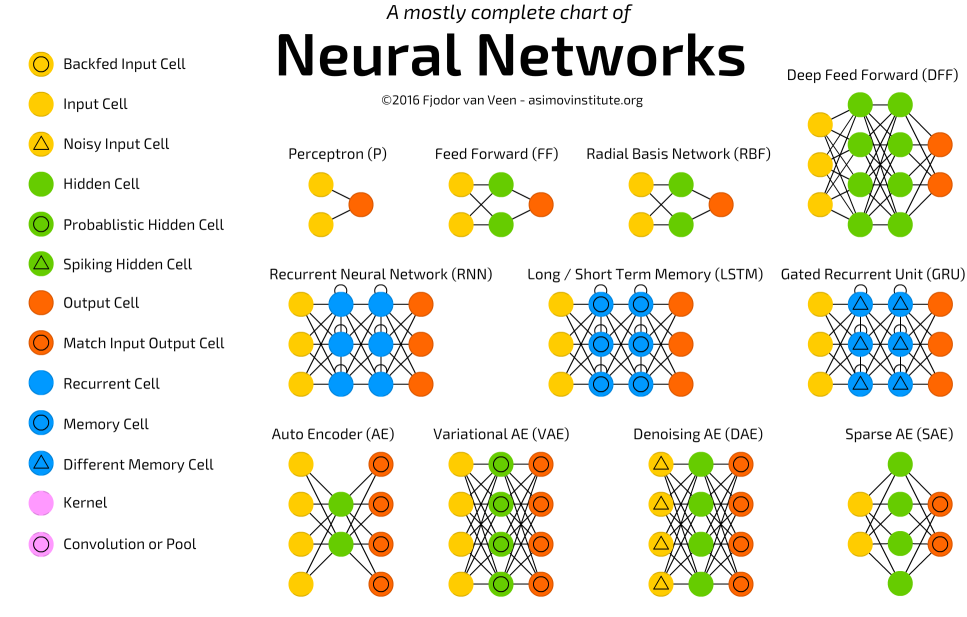

# Capítulo 2 - DeepLearBook

## Uma Breve História das Redes Neurais Artificiais

Para compreender onde estamos hoje, precisamos olhar para o passado e analisar como chegamos até aqui. Vejamos então Uma Breve História das Redes Neurais Artificiais.

O cérebro humano é uma máquina altamente poderosa e complexa capaz de processar uma grande quantidade de informações em tempo mínimo. As unidades principais do cérebro são os neurônios e é por meio deles que as informações são transmitidas e processadas. As tarefas realizadas pelo cérebro intrigam os pesquisadores, como por exemplo, a capacidade do cérebro de reconhecer um rosto familiar dentre uma multidão em apenas milésimos de segundo. As respostas sobre alguns enigmas do funcionamento do cérebro ainda não foram respondidas e se perpetuam ate os dias de hoje. O que é conhecido sobre o funcionamento do cérebro é que o mesmo desenvolve suas regras através da experiência adquirida em situações vividas anteriormente.

>A máquina mais fantástica do planeta terra.

desenvolvimento do cérebro humano ocorre principalmente nos dois primeiros anos de vida, mas se arrasta por toda a vida. 
Inspirando-se neste modelo, diversos pesquisadores tentaram simular o funcionamento do cérebro, principalmente o processo de aprendizagem por experiência, a fim de criar sistemas inteligentes capazes de realizar tarefas como classificação, reconhecimento de padrões, processamento de imagens, entre outras atividades. 
Em 1943, o neurofisiologista Warren McCulloch e o matemático Walter Pitts escreveram um artigo sobre como os neurônios poderiam funcionar e para isso, eles modelaram uma rede neural simples usando circuitos elétricos. 
Warren McCulloch e Walter Pitts criaram um modelo computacional para redes neurais baseadas em matemática e algoritmos denominados lógica de limiar (threshold logic). 
Este modelo abriu o caminho para a pesquisa da rede neural dividida em duas abordagens: uma abordagem focada em processos biológicos no cérebro, enquanto a outra focada na aplicação de redes neurais à inteligência artificial. 
Em 1949, Donald Hebb escreveu The Organization of Behavior, uma obra que apontou o fato de que os caminhos neurais são fortalecidos cada vez que são usados, um conceito fundamentalmente essencial para a maneira como os humanos aprendem. 
medida que os computadores se tornaram mais avançados na década de 1950, finalmente foi possível simular uma hipotética rede neural. 
No entanto, ao longo deste tempo, os defensores das “máquinas pensantes” continuaram a argumentar suas pesquisas. 
Nos anos seguintes ao Projeto Dartmouth, John von Neumann sugeriu imitar funções simples de neurônios usando relés telegráficos ou tubos de vácuo.

>Algumas Arquiteturas de Redes Neurais.

Em uma exibição típica do amor de Stanford por siglas, os nomes provêm do uso de múltiplos elementos ADAptive LINear. 
ADALINE foi desenvolvido para reconhecer padrões binários de modo que, se ele estivesse lendo bits de transmissão de uma linha telefônica, poderia prever o próximo bit. 
MADALINE foi a primeira rede neural aplicada a um problema do mundo real, usando um filtro adaptativo que elimina ecos nas linhas telefônicas. 
Infelizmente, esses sucessos anteriores levaram as pessoas a exagerar o potencial das redes neurais, particularmente à luz da limitação na eletrônica, então disponível na época. 
Este exagero excessivo, que decorreu do mundo acadêmico e técnico, infectou a literatura geral da época. 
A série de Asimov em robôs revelou os efeitos sobre a moral e os valores do homem quando máquinas fossem capazes de fazer todo o trabalho da humanidade. 
Toda essa discussão sobre o efeito da Inteligência Artificial sobre a vida humana, aliada aos poucos progressos, fizeram vozes respeitadas criticar a pesquisa em redes neurais. 
Em 1986, com redes neurais de várias camadas nas notícias, o problema era como estender a regra Widrow-Hoff para várias camadas. 
Três grupos independentes de pesquisadores, dentre os quais David Rumelhart, ex-membro do departamento de psicologia de Stanford, apresentaram ideias semelhantes que agora são chamadas de redes Backpropagation porque distribuem erros de reconhecimento de padrões em toda a rede. 
O resultado é que as redes de Backpropagation “aprendem” de forma mais lenta, pois necessitam, possivelmente, de milhares de iterações para aprender, mas geram um resultado muito preciso. 
A ideia fundamental por trás da natureza das redes neurais é que, se ela funcionar na natureza, deve ser capaz de funcionar em computadores. 
diagrama abaixo mostra alguns marcos importantes na evolução e pesquisa das redes neurais artificiais. 
O fato, é que ainda estamos escrevendo esta história e muita evolução está ocorrendo neste momento, através do trabalho de milhares de pesquisadores e profissionais de Inteligência Artificial em todo mundo.

>Linha do tempo das redes neurais.

 

Podemos resumir assim os principais marcos na pesquisa e evolução das redes neurais artificiais até chegarmos ao Deep Learning: 
 
1958: Frank Rosenblatt cria o Perceptron, um algoritmo para o reconhecimento de padrões baseado em uma rede neural computacional de duas camadas usando simples adição e subtração.

1989: os cientistas conseguiram criar algoritmos que usavam redes neurais profundas, mas os tempos de treinamento para os sistemas foram medidos em dias, tornando-os impraticáveis ​​para o uso no mundo real.

Meados dos anos 2000: o termo “aprendizagem profunda” começa a ganhar popularidade após um artigo de Geoffrey Hinton e Ruslan Salakhutdinov mostrar como uma rede neural de várias camadas poderia ser pré-treinada uma camada por vez.

2009: acontece o NIPS Workshop sobre Aprendizagem Profunda para Reconhecimento de Voz e descobre-se que com um conjunto de dados suficientemente grande, as redes neurais não precisam de pré-treinamento e as taxas de erro caem significativamente. 

2016: o algoritmo do Google DeepMind, AlphaGo, mapeia a arte do complexo jogo de tabuleiro Go e vence o campeão mundial de Go, Lee Sedol, em um torneio altamente divulgado em Seul. 
Em vez disso, demonstra que, dado um conjunto de dados suficientemente grande, processadores rápidos e um algoritmo suficientemente sofisticado, os computadores podem começar a realizar tarefas que até então só podiam ser realizadas apenas por seres humanos, como reconhecer imagens e voz, criar obras de arte ou tomar decisões por si mesmo. 
Os estudos sobre as redes neurais sofreram uma grande revolução a partir dos anos 80 e esta área de estudos tem se destacado, seja pelas promissoras características apresentadas pelos modelos de redes neurais propostos, seja pelas condições tecnológicas atuais de implementação que permitem desenvolver arrojadas implementações de arquiteturas neurais paralelas em hardwares dedicado, obtendo assim ótimas performances destes sistemas (bastante superiores aos sistemas convencionais).

- Para acessar o contéudo completo do livro, acesse: [deeplearningbook](https://www.deeplearningbook.com.br/)